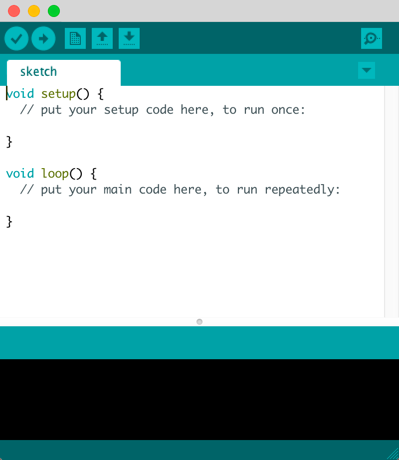

# Introducción a Arduino

Todo sistema robótico está formado por:
- Un sistema motriz, encargado de generar los movimientos del robot.
- Un conjunto de sensores, que ofrecerá al robot una visión del entorno que le rodea.
- Un sistema de control, que analizará los datos recibidos a través de los sensores y decidirá cómo debe actuar el robot en consecuencia, mostrando así cierta autonomía e inteligencia.

En este capítulo explicamos las características de Arduino, y como instalar los diferentes programas que utilizaremos para programar una tarjeta de Arduino.

- [Qué es Arduino](#qué-es-arduino)
- [Instalar Arduino](#instalar-arduino)
	- [Instalación en Linux](#instalación-en-linux)
	- [Instalación en Windows](#instalación-en-windows)
	- [Instalación en Mac](#instalación-en-mac)
	- [Hola Mundo](#hola-mundo)
- [Instalar S4A](#resistencias)


=============


## Qué es Arduino

Arduino es una plataforma de prototipos de electrónica y de código abierto (open-source) basada en hardware y software flexible y fácil de usar. 

Arduino puede ser utilizada como sistema de control de nuestros robots gracias a su microcontrolador ATmega328.


#### *Características*

| ARDUINO UNO REV3          |           |
| ------------------------- | --------- |
| Entradas digitales        | 14        |
| Salidas digitales         | 14        |
| Entradas analógicas       | 6         |
| Salidas PWM       		| 6         |
| Pines de GND (tierra)     | 3         |
| VC 3.3V                   | 1         |
| VC 5V                     | 1         |
| Alimentación externa      | 9V        |
| Puerto USB                | 1         |


=============


## Instalar Arduino

Primero conectamos la tarjeta controladora a través del cable USB, y a continuación descargamos el software de programación desde la página web [Arduino.org](http://www.arduino.org). Dependiendo del sistema operativo que utilicemos procederemos a una de las siguientes instalaciones.

- [Instalación en Linux](#instalación-en-linux)
- [Instalación en Windows](#instalación-en-windows)
- [Instalación en Mac](#instalación-en-mac)

### Instalación en Linux

Nos hemos basado en la distribución **Ubuntu** para realizar esta guía de instalación puesto que la mayoría de las distribuciones de Linux a nivel educativo se basan en ella.

Para trabajar con Arduino es preciso que nuestra distribución tenga instalados los siguientes paquetes además de Arduino IDE.

```
- sun's java runtime (jre)
- gcc-avr
- avr-libc
- binutils-avr
```

Para instalar dichos paquetes vamos a necesitar la clave de administrador. A continuación abrimos un nuevo terminal o consola y ejecutamos las siguientes instrucciones:

```
$ sudo add-apt-repository ppa:arduino-ubuntu-team
$ sudo apt-get update
$ sudo apt-get install arduino
```

Para ejecutar la aplicación de Arduino IDE, basta con acceder al menú *Aplicaciones > Programación > Arduino*.


### Instalación en Windows

Descargamos el software de Arduino desde la sección de descargas de la página web [Arduino.org](http://www.arduino.org/downloads) y procedemos a ejecutar el programa descargado aceptando la licencia de uso y siguiendo los pasos que aparecen en el instalador.


### Instalación en Mac

De igual manera que en el caso de instalación en Windows, en primer lugar descargamos el software de Arduino desde la sección de descargas de la página web [Arduino.org](http://www.arduino.org/downloads) y procedemos a ejecutar el programa descargado aceptando la licencia de uso y siguiendo los pasos que aparecen en el instalador.


### Hola Mundo

El siguiente paso será ejecutar el programa de Arduino que hemos instalado. Independientemente del sistema operativo utilizado, accederemos a una ventana similar a la siguiente.



En ella podemos crear nuestros propios programas introduciendo las líneas de código y posteriormente cargarlos en la tarjeta Arduino utilizando la opción de menú *cargar* que se incluye en el menú *archivo*.

O bien podemos cargar directamente en la tarjeta Arduino los ejemplos que podemos encontrar en la opción *ejemplos* del menú *archivos*.

=============


## Instalar S4A


=============


#### Licencia

 Esta obra se distribuye bajo licencia [Reconocimiento-CompartirIgual 4.0 Internacional (CC BY-SA 4.0)](https://creativecommons.org/licenses/by-sa/4.0/deed.es_ES).
