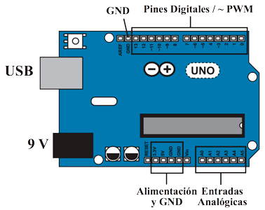

# Introducción a Arduino

Todo sistema robótico está formado por:
- Un sistema motriz, encargado de generar los movimientos del robot.
- Un conjunto de sensores, que ofrecerá al robot una visión del entorno que le rodea.
- Un sistema de control, que analizará los datos recibidos a través de los sensores y decidirá cómo debe actuar el robot en consecuencia, mostrando así cierta autonomía e inteligencia.

Para que el robot adquiera cierta inteligencia es muy importante saber elaborar la correcta programación del sistema de control.

- [Qué es Arduino](#qué-es-arduino)
- [Instalar Arduino](#instalar-arduino)
- [Instalar S4A](#resistencias)

=============

## Qué es Arduino

Arduino es una plataforma de prototipos de electrónica y de código abierto (open-source) basada en hardware y software flexible y fácil de usar. 

Arduino puede ser utilizada como sistema de control de nuestros robots gracias a su microcontrolador ATmega328.

#### *Características*

| ARDUINO UNO REV3          |           |
| ------------------------- | --------- |
| Entradas digitales        | 14        |
| Salidas digitales         | 14        |
| Entradas analógicas       | 6         |
| Salidas PWM       		| 6         |
| Pines de GND (tierra)     | 3         |
| VC 3.3V                   | 1         |
| VC 5V                     | 1         |
| Alimentación externa      | 9V        |
| Puerto USB                | 1         |

=============

## Instalar Arduino
## Instalar S4A

=============

#### Licencia

 Esta obra se distribuye bajo licencia [Reconocimiento-CompartirIgual 4.0 Internacional (CC BY-SA 4.0)](https://creativecommons.org/licenses/by-sa/4.0/deed.es_ES).
