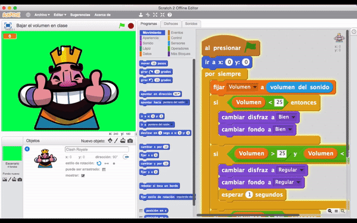
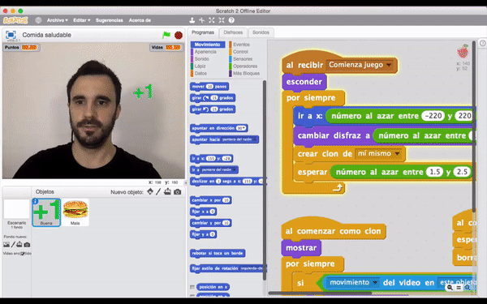
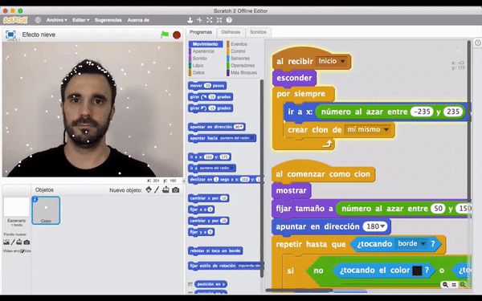

# II Jornadas sobre Robótica Educativa (Murcia)

Jornadas sobre Robótica Educativa dirigidas al profesorado de la Region de Murcia, fundamentalmente a maestros y profesores que imparten la asignatura de Robótica, así como al resto de docentes interesados en su aprendizaje, durante los días **8 y 10 de Mayo de 2017** en la **Facultad de Informática de la Universidad de Murcia**.

***

## Realidad Aumentada con Scratch

 

### Bajar el Volumen en clase

Proyecto de Realidad Aumentada con Scratch para detectar el audio de la clase y sensibilizar a los niños para que bajen el volumen.

#### Enlaces 
- Proyecto compartido en la web de [Scratch](https://scratch.mit.edu/projects/159779241/)
- [Curso completo en Programo Ergo Sum](http://www.programoergosum.com/cursos-online/programacion-para-docentes/225-realidad-aumentada-y-control-de-volumen-con-scratch)
- [Lista de reproducción en YouTube](https://www.youtube.com/playlist?list=PLGlS7vMgjN7XmsaXKt3ZzPa4qt3SV7veo)

 
 

### Gráficas del sonido
Proyecto de Realidad Aumentada con Scratch para detectar el audio de la clase y sensibilizar a los niños para que bajen el volumen.

#### Enlaces 
- Proyecto compartido en la web de [Scratch](https://scratch.mit.edu/projects/159798128/)
- [Curso completo en Programo Ergo Sum](http://www.programoergosum.com/cursos-online/programacion-para-docentes/227-graficas-de-audio-con-realidad-aumentada-y-scratch)
- [Lista de reproducción en YouTube](https://www.youtube.com/playlist?list=PLGlS7vMgjN7U6or-jRzWpAaZ54a-cwla4)

 
 

### Comida saludable
Proyecto de Realidad Aumentada con Scratch para conseguir puntos comiendo comida saludable. La comida menos saludable resta vidas.

#### Enlaces 
- Proyecto compartido en la web de [Scratch](https://scratch.mit.edu/projects/159885713/)
- [Curso completo en Programo Ergo Sum](http://www.programoergosum.com/cursos-online/scratch/167-pokemon-go-programado-con-scratch-y-realidad-aumentada)
- [Lista de reproducción en YouTube](https://www.youtube.com/playlist?list=PLGlS7vMgjN7Vb6j5DAcq6v-PyPYofcUL6)

 
 

### Nieve
Proyecto de Realidad Aumentada con Scratch simulando copos de nieve que se detienen en nuestro pelo.

#### Enlaces 
- Proyecto compartido en la web de [Scratch](https://scratch.mit.edu/projects/147157528/)

 

***

#### Licencia

 Esta obra se distribuye bajo licencia [Reconocimiento-CompartirIgual 4.0 Internacional (CC BY-SA 4.0)](https://creativecommons.org/licenses/by-sa/4.0/deed.es_ES).
