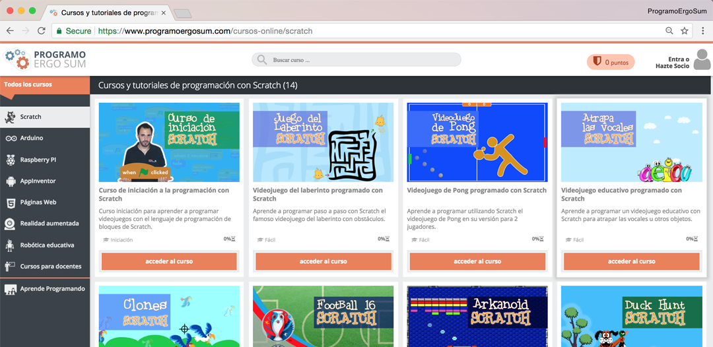
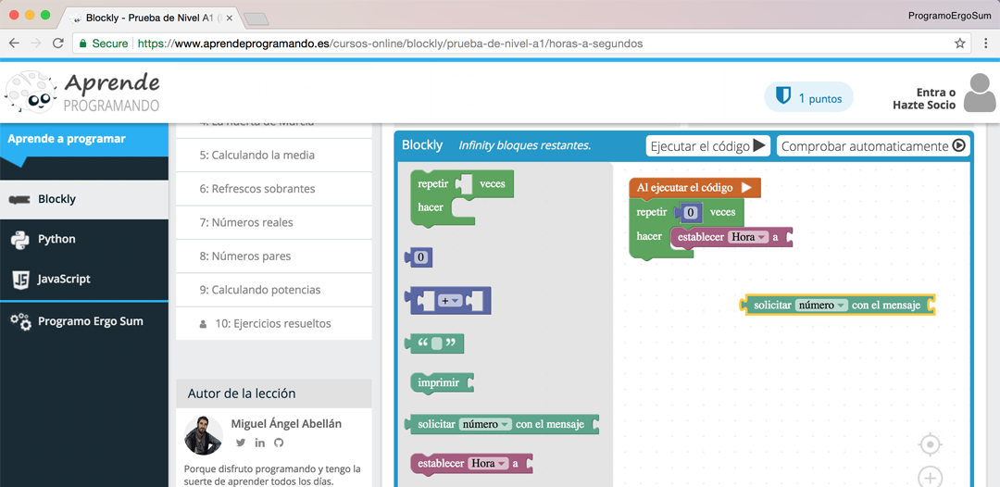
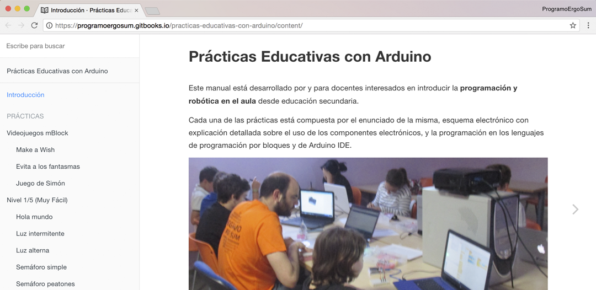

# III Jornadas sobre Robótica Educativa (Murcia)

Jornadas sobre Robótica Educativa dirigidas al profesorado de la Region de Murcia, fundamentalmente a maestros y profesores que imparten la asignatura de Robótica, así como al resto de docentes interesados en su aprendizaje, durante el **9 de Mayo de 2018** en la **Facultad de Informática de la Universidad de Murcia**.

***

## Programo Ergo Sum

Presentación de la plataforma de cursos online gratuitos MOOCs de programación, electrónica y robótica.

- [Programo Ergo Sum](https://www.programoergosum.com/)

 

## Aprende Programando

Presentación de la plataforma guiada para aprender a programar diferentes lenguajes de programación utilizando las matemáticas, física, tecnología, etc. STEM.

- [Aprende Programando](https://www.aprendeprogramando.es/)

 

## El Cable Amarillo

Presentación del libro de prácticas educativas con Arduino realizadas por y para docentes.

- [El Cable Amarillo](http://www.elcableamarillo.cc/)

 

***

#### Licencia

 Esta obra se distribuye bajo licencia [Reconocimiento-CompartirIgual 4.0 Internacional (CC BY-SA 4.0)](https://creativecommons.org/licenses/by-sa/4.0/deed.es_ES).
