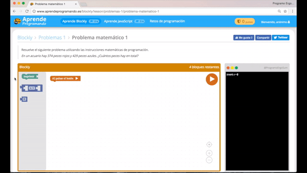
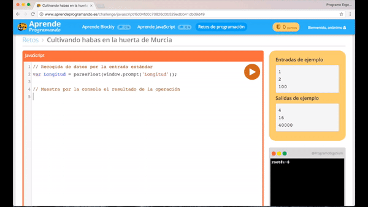

# Intercambio de experiencias en Educación Matemática (Murcia)

Jornadas para comunicar y compartir experiencias, tendencias metodológicas y buenas prácticas sobre una determinada materia o competencia docente, dirigidas al profesorado de la Región de Mucia, durante los días **26 y 27 de Mayo de 2017** en la **Facultad de Matemáticas de la Universidad de Murcia**. 

***

## Programando las matemáticas

*En los últimos años se han conocido iniciativas que tratan de potenciar la enseñanza de la programación informática desde edades tempranas. La comunidad educativa y científica ha colaborado en el desarrollo de estudios que demuestran que los niños que aprenden a programar obtienen mejores resultados en pruebas matemáticas, de razonamiento y de resolución de problemas. Desde la Iniciativa Programo Ergo Sum, se ha creado el proyecto Aprende Programando, una plataforma online de aprendizaje guiado hacia las STEM utilizando la programación informática como medio de aprendizaje y destinado principalmente a docentes de Educación Secundaria para su uso en el aula.*

[Ver Comunicación completa](Secundaria_abellan_ferriz_miguel_angel.pdf)

 

- [Educación Primaria](#educación-primaria)
- [Educación Secundaria](#educación-secundaria)

***

## Educación Primaria

La aplicación de los lenguajes de programación por bloques permiten una presentación visual del paradigma y metodología de la programación informática permitiendo centrarse en la lógica de la programación dejando a un lado la sintaxis propia de los lenguajes de programación como puntos y comas, paréntesis, etc.

### Code.org 

- **Curso 2: Desde 6 años**
    - **Etapa 3**: Secuencias
        - [Puzzle 1](https://studio.code.org/s/course2/stage/3/puzzle/1)
        - [Puzzle 6](https://studio.code.org/s/course2/stage/3/puzzle/6)
    - **Etapa 6**: Bucles
        - [Puzzle 8](https://studio.code.org/s/course2/stage/6/puzzle/8) (5 bloques)
        - [Puzzle 9](https://studio.code.org/s/course2/stage/6/puzzle/9) (9 bloques)

- **Curso 3: Desde 8 años**
    - **Etapa 2**: Secuencias
        - [Puzzle 1](https://studio.code.org/s/course3/stage/2/puzzle/1)
        - [Puzzle 5](https://studio.code.org/s/course3/stage/2/puzzle/5)
        - [Puzzle 11](https://studio.code.org/s/course3/stage/2/puzzle/11)
    - **Etapa 6**: Bucles
        - [Puzzle 1](https://studio.code.org/s/course3/stage/6/puzzle/1) (10 bloques)
    - **Etapa 7**: Condiciones
        - [Puzzle 1](https://studio.code.org/s/course3/stage/7/puzzle/1)
        - [Puzzle 3](https://studio.code.org/s/course3/stage/7/puzzle/3)
        - [Puzzle 5](https://studio.code.org/s/course3/stage/7/puzzle/5)
    - **Etapa 12**: Bucles avanzados
        - [Puzzle 1](https://studio.code.org/s/course3/stage/12/puzzle/1)
        - [Puzzle 5](https://studio.code.org/s/course3/stage/12/puzzle/5)
        - [Puzzle 9](https://studio.code.org/s/course3/stage/12/puzzle/9) (9 bloques)
        
 
 
        
#### Scratch

- [Scratch](https://scratch.mit.edu)

 
 
 
#### Aprende Programando

- Programando las matemáticas [AprendeProgramando](http://www.aprendeprogramando.es)
    - [Matemáticas 1](http://www.aprendeprogramando.es/blockly/lessons/matematicas-1)
    - [Matemáticas 2](http://www.aprendeprogramando.es/blockly/lessons/matematicas-2)
    - [Matemáticas 3](http://www.aprendeprogramando.es/blockly/lessons/matematicas-3)
    - [Problemas 1](http://www.aprendeprogramando.es/blockly/lessons/problemas-1)
    - [Problemas 2](http://www.aprendeprogramando.es/blockly/lessons/problemas-2)

- **Retos: 4º, 5º y 6º**
    - [Sumando números enteros](http://www.aprendeprogramando.es/challenge/blockly/0fc2e77f1265a025d7ca0cf9e37a0df0)
    - [El número posterior](http://www.aprendeprogramando.es/challenge/blockly/7ba79d8e74a6c4068a5ced86bd9b86a8)
    - [Calculando cuadrados](http://www.aprendeprogramando.es/challenge/blockly/1b2a27830e81188cc33aa8ed9ea82b2b)
    - [Horas a segundos](http://www.aprendeprogramando.es/challenge/blockly/ef1202910bbf550c031bfaf39bd43d8d)
    - [Vueltas por minuto de un Spinner](http://www.aprendeprogramando.es/challenge/blockly/1190071bb5b20ca6083ddb1bd0c86a92)
    - [Números mayores que 10](http://www.aprendeprogramando.es/challenge/blockly/caf554af263045e5c774c1318f0cd5e6)

 
 

***

 
 

## Educación Secundaria

El objetivo principal del proyecto Aprende Programando es fomentar el uso de la programación informática para el desarrollo de la creatividad y del pensamiento científico y, en particular, el pensamiento matemático, y evolucionar distintas competencias en el mundo de la educación gracias a un software sencillo y completamente intuitivo.

### Code.org 

- **Curso acelerado: Desde 12 años**
    - **Etapa 2**: Secuencias
        - [Puzzle 1](https://studio.code.org/s/20-hour/stage/2/puzzle/1)
        - [Puzzle 5](https://studio.code.org/s/20-hour/stage/2/puzzle/5)
        - [Puzzle 10](https://studio.code.org/s/20-hour/stage/2/puzzle/10)
        - [Puzzle 15](https://studio.code.org/s/20-hour/stage/2/puzzle/15)
        - [Puzzle 20](https://studio.code.org/s/20-hour/stage/2/puzzle/20)
    - **Etapa 9**: Bucles y condiciones
        - [Puzzle 1](https://studio.code.org/s/20-hour/stage/9/puzzle/1)
        - [Puzzle 2](https://studio.code.org/s/20-hour/stage/9/puzzle/2)
        - [Puzzle 4](https://studio.code.org/s/20-hour/stage/9/puzzle/4)
        - [Puzzle 5](https://studio.code.org/s/20-hour/stage/9/puzzle/5)
        - [Puzzle 6](https://studio.code.org/s/20-hour/stage/9/puzzle/6)
        - [Puzzle 10](https://studio.code.org/s/20-hour/stage/9/puzzle/10)
        - [Puzzle 11](https://studio.code.org/s/20-hour/stage/9/puzzle/11)
    - **Etapa 13**: Funciones
        - [Puzzle 1](https://studio.code.org/s/20-hour/stage/13/puzzle/1)
        - [Puzzle 2](https://studio.code.org/s/20-hour/stage/13/puzzle/2)
        - [Puzzle 3](https://studio.code.org/s/20-hour/stage/13/puzzle/3)
        - [Puzzle 4](https://studio.code.org/s/20-hour/stage/13/puzzle/4)
        - [Puzzle 6](https://studio.code.org/s/20-hour/stage/13/puzzle/6)
        - [Puzzle 9](https://studio.code.org/s/20-hour/stage/13/puzzle/9)
        - [Puzzle 10](https://studio.code.org/s/20-hour/stage/13/puzzle/10)       
    - **Etapa 17**: Depuración
        - [Puzzle 1](https://studio.code.org/s/20-hour/stage/17/puzzle/1)
        - [Puzzle 3](https://studio.code.org/s/20-hour/stage/17/puzzle/3)
        - [Puzzle 7](https://studio.code.org/s/20-hour/stage/17/puzzle/7)
        - [Puzzle 8](https://studio.code.org/s/20-hour/stage/17/puzzle/8)
        - [Puzzle 9](https://studio.code.org/s/20-hour/stage/17/puzzle/9)

#### Aprende Programando

- [Acceder a www.aprendeprogramando.es](http://www.aprendeprogramando.es)

 

***

#### Licencia

 Esta obra se distribuye bajo licencia [Reconocimiento-CompartirIgual 4.0 Internacional (CC BY-SA 4.0)](https://creativecommons.org/licenses/by-sa/4.0/deed.es_ES).
