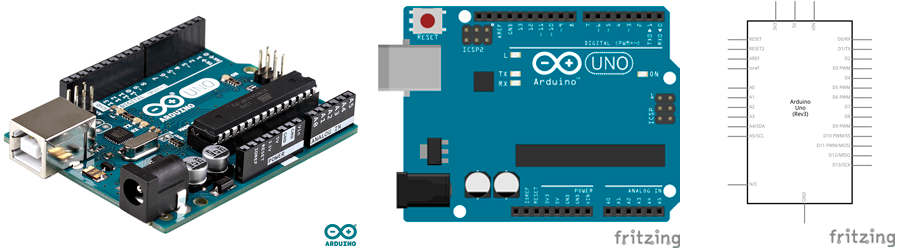
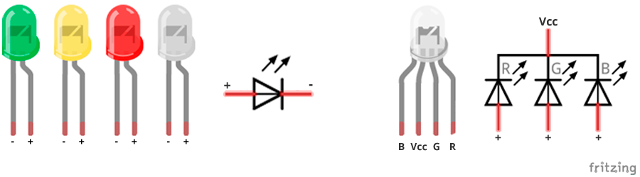
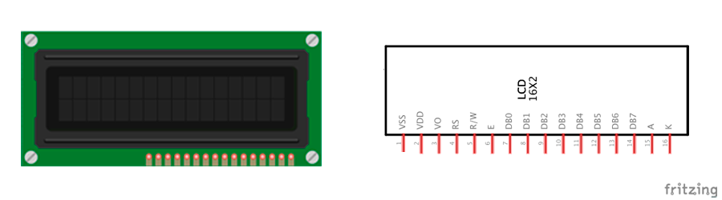

# Listado de materiales

El kit básico se presenta en una maleta transparente que incluye en su interior un estuche con compartimentos, lo que facilita la localización de los componentes desde el exterior.
Uno de los maletines es un estuche con 7 compartimentos, donde se aloja el pequeño material electrónico como resistencias, diodos, etc.

El kit contiene los siguientes materiales:
- [1 Placa de Arduino UNO Rev3](#1-placa-de-arduino-uno-rev3)
- [1 Placa protoboard de 830 puntos](#1-placa-protoboard-de-830-puntos)
- [50 Latiguillos macho-macho](#50-latiguillos-macho-macho)
- [3x5 Diodos Led](#3x5-diodos-led)
- [10x6 Resistencias](#10x6-resistencias)
- [10 Diodos 1N4007](#10-diodos-1n4007)
- [2 Zumbadores piezo-eléctricos activos](#2-zumbadores-piezo-eléctricos-activos)
- [5 Interruptores de palanca](#5-interruptores-de-palanca)
- [1 Sensor TSOP 4838 con mando a distancia](#sensor-tsop-4838-con-mando-a-distancia)
- [1 Display LCD 1602A](#1-display-lcd-1602a)
- [5 fotoresistencias LDR](#5-fotoresistencias-ldr)
- [2 Potenciómetros de 10KOmhios](#potenciómetro)
- [2 Servo motores](#servo-motores)
- [1 Motor de corriente continua y polea](#motor-de-corriente-continua)
- [3 Sensores de temperatura LM35](#sensor-de-temperatura-lm35)
- [1 Sensor de temperatura y humedad](#sensor-de-temperatura-y-humedad)
- [1 Sensor de proximidad HC-SR04](#sensor-de-proximidad-hc-sr04)
- [2 Sensores de infrarrojos CNY70](#sensor-de-infrarrojos-cny70)
- [1 Sensor giroscopio de 3 ejes](#sensor-giroscopio)
- [1 Motor paso a paso con controlador](#motor-paso-a-paso)
- [1 Bluetooth Shield HC-06](#bluetooth)
- [1 Placa auxiliar de aprendizaje Picnuino](#picuino)

=============

## 1 Placa de Arduino UNO Rev3

**Arduino** es una plataforma para prototipado de electrónica basada en hardware y software libre, es decir, podemos construir circuitos eléctricos y programarlos.

#### *Características*

| Arduino UNO Rev3          |           |
| ------------------------- | --------- |
| Microprocesador           | ATmega328 |
| Tensión operativa         | 5V        |
| Tensión de alimentación   | 7-12V     |
| Entradas digitales        | 14        |
| Salidas digitales         | 14        |
| Entradas analógicas       | 6         |
| Memoria flash             | 32Kb      |
| SRAM                      | 2Kb       |
| EEPROM                    | 1Kb       |
| Velocidad del reloj       | 16MHz     |
| Máxima VC para entradas   | 40mA      |
| Máxima VC para pines 3.3V | 50mA      |

=============

## 1 Placa protoboard de 830 puntos

Una **protoboard** es una placa para prototipar circuitos eléctricos conectandos en sus orificios sin necesidad de soldar los componentes.

#### *Características*

| Protoboard  |                 |
| ----------- | --------------- |
| Contactos   | 830 puntos      |
| Serigrafías | Sí, polarizadas |

=============

## 50 Latiguillos macho-macho

Los **latiguillos** son utilizados para conectar entre si los diferentes componentes electrónicos.

#### *Características*

| Latiguillos |                           |
| ----------- | ------------------------- |
| Cantidad    | 50 latiguillos de colores |
| Longitud    | 20cm                      |

=============

## 3x5 Diodos Led

Un **diodo Led** es un componente eléctrico que emite luz al paso de corriente eléctrica sobre él, desde el polo positivo (ánodo) al polo negativo (cátodo). Por otro lado, nos encontramos con un diodo Led especial de 4 patillas llamado **diodo Led RGB** (en este caso de ánodo común) lo que significa que la patilla más larga corresponde al polo positivo (ánodo).

En el kit encontraremos:
- 12 Diodos Led de colores verde, ámbar, rojo y blanco.
- 3 Diodos Led RGB ánodo común.

#### *Características*

| Diodos Led de colores            |        |
| -------------------------------- | ------ |
| Polarizado                       | Sí     |
| Diámetro                         | 5mm    |
| Itensidad de Corriente           | 20mA   |
| Tensión Led (verde, ámbar, rojo) | 2,1V   |
| Tensión Led blanco               | 3,3V   |

| Diodo Led RGB (ánodo común)      |        |
| -------------------------------- | ------ |
| Polarizado                       | Sí     |
| Diámetro                         | 5mm    |
| Itensidad de Corriente           | 20mA   |
| Tensión en Led (rojo)            | 2,1V   |
| Tensión en Led (verde)           | 3,3V   |
| Tensión en Led (azul)            | 3,3V   |

=============

## 10x6 Resistencias

Los **resistores** son un componente eléctrico que se oponen el paso de la corriente en un circuito. 

En el kit encontramos 6 valores distintos de resistencias:
- 100Ω (marrón-negro-marrón)
- 220Ω (rojo-rojo-marrón)
- 330Ω (naranja-naranja-marrón)
- 1KΩ (marrón-negro-rojo)
- 4,7KΩ (amarillo-morado-rojo)
- 10KΩ (marrón-negro-naranja)

#### *Características*

| Resistencia                      |      |
| -------------------------------- | ---- |
| Polarizado                       | No   |
| Potencia de disipación           | 0,5W |
| Precisión                        | 5%   |

=============

## 10 Diodos 1N4007

Un **diodo** es un componente eléctrico que permite el paso de la corriente en un solo sentido, desde el polo positivo (ánodo) al polo negativo (cátodo).

#### *Características*

| Diodo 1N4007                    |       |
| -------------------------------- | ----- |
| Polarizado                       | Sí    |
| Tensión en polarización directa  | 1,1V  |
| Tensión en polarización inversa  | 1000V |

=============

## 2 Zumbadores piezo-eléctricos activos

Un **zumbador** es un componente eléctrico que emite una frecuencia de sonidos al paso de la corriente eléctrica sobre él desde el polo positivo (ánodo) al polo negativo (cátodo).

#### *Características*

| Zumbador piezo-eléctrico         |       |
| -------------------------------- | ----- |
| Polarizado                       | Sí    |
| Tensión de trabajo               | 3-12V |

=============

## 5 Interruptores de palanca

Con un **interruptor** podemos abrir o cerrar el circuito eléctrico accionando la palanca.

#### *Características*

| Interruptor de palanca           |       |
| -------------------------------- | ----- |
| Polarizado                       | No    |

=============

## 1 Sensor TSOP 4838 con mando a distancia

El **TSOP 4838** es un sensor infrarrojos utilizado para recibir la señal desde un mando a distancia.

#### *Características*

| Sensor TSOP 4838                 |       |
| -------------------------------- | ----- |
| Polarizado                       | Sí    |
| Distancia máxima de trabajo      | 45m   |

=============

## 1 Display LCD 1602A

Con un **display LCD** podemos mostrar por pantalla caracteres alfanuméricos, como mensajes de texto.

#### *Características*

| Display LCD 1602A |                                   |
| ----------------- | --------------------------------- |
| 1     VSS         | Conectado a GND                   |
| 2     VDD         | Conectado a 5V                    |
| 3     NC          | Contraste del LCD                 |
| 4     RS          | Selector de comandos / registros  |
| 5     RW          | Selector de Lectura / Escritura   |
| 6     E           | Habilitado recibir información    |
| 7-14  DB0-DB7     | Bus de datos                      |
| 15    A           | Luz de fondo del LCD - 5V         |
| 16    K           | Luz de fondo del LCD - GND        |

=============

## 5 fotoresistencias LDR

El **sensor LDR** es una resistencia sensible a la luz, es decir, cambia el valor de su resistencia según la cantidad de luz que incide sobre él.

#### *Características*

| Sensor LDR                        |       |
| --------------------------------- | ----- |
| Polarizado                        | No    |
| Resistencia mínima (con luz)      | 100Ω  |
| Resistencia máxima (sin luz)      | 1MΩ   |

=============

## Potenciómetro

Un **potenciómetro** es una resistencia variable mecánica, es decir, podemos regular su valor manualmente.

#### *Características*

| Potenciómetro      |       |
| ------------------ | ----- |
| Polarizado         | No    |
| Resistencia mínima | 0Ω    |
| Resistencia máxima | 10KΩ  |
| Precisión          | 5%    |

=============

## Servo motores

Un **miniservo** es un componente eléctrico similar a un motor capaz de girar una determinada cantidad de grados, entre 0° y 180° en este caso.

#### *Características*

| Servo motores      |                  |
| ------------------ | ---------------- |
| Polarizado         | Sí               |
| Rotación           | 0° a 180°        |
| Torque estático    | 4,5V > 1,5Kg/cm  |

=============

## Motor de corriente continua

El **motor** genera una velocidad de giro y dirección en el rotor del motor, dependiendo de la tensión y polarización.

#### *Características*

| Motor de CC        |                 |
| ------------------ | --------------- |
| Polarizado         | No              |
| Tensión máxima     | 4,5V            |
| Potencia           | 0,5W            |
| RPM                | 9800rpm a 4,5V  |

=============

## Sensor de temperatura LM35

El **sensor de temperatura LM35** proporciona una salida de voltaje proporcional a la temperatura.

#### *Características*

| Sensor de temperatura LM35    |               |
| ----------------------------- | ------------- |
| Polarizado                    | Si            |
| Señal de salida               | Analógica     |
| Tensión                       | 3V a 5V       |
| Rango de medición             | -55° a 150°C  |
| Precisión                     | ±0,5°C        |

=============

## Sensor de temperatura y humedad

El **sensor de temperatura y humedad** integrado se compone de un sensor capacitivo para medir la humedad y un sensor de temperatura.

#### *Características*

| Sensor de temperatura y humedad    |            |
| ---------------------------------- | ---------- |
| Polarizado                         | Si         |
| Señal de salida                    | Digital    |
| Tensión                            | 3V a 5V    |
| Rango de medición                  | 0° a 50°C  |
| Precisión                          | ±2°C       |

=============

## Sensor de proximidad HC-SR04

El **sensor de proximidad HC-SR04** es un sensor ultrasónico capaz de medir distancias pequeñas hasta un obstáculo.

#### *Características*

| Sensor de proximidad HC-SR04  |           |
| ----------------------------- | --------- |
| Polarizado                    | Si        |
| Señal de salida               | Digital   |
| Tensión                       | 5V        |
| Rango de medición             | 2cm a 4m  |

=============

## Sensor de infrarrojos CNY70

El **sensor de infrarrojos** es un sensor óptico capaz de detectar colores de objetos y superficies.

#### *Características*

| Sensor de infrarrojos CNY70   |           |
| ----------------------------- | --------- |
| Polarizado                    | Si        |
| Señal de salida               | Digital   |
| Tensión                       | 5V        |
| Rango de medición             | 0 a 5cm   |

=============

## Sensor giroscopio
## Motor paso a paso
## Bluetooth
## Picuino

=============

#### Licencia

 Esta obra se distribuye bajo licencia [Reconocimiento-CompartirIgual 4.0 Internacional (CC BY-SA 4.0)](https://creativecommons.org/licenses/by-sa/4.0/deed.es_ES).
