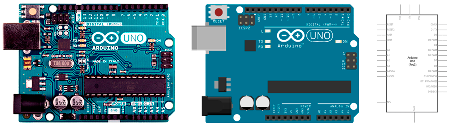
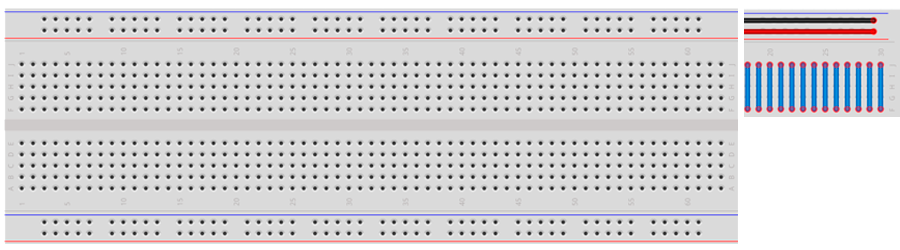

# Lista de materiales

El kit básico se presenta en una maleta transparente que incluye en su interior un estuche con compartimentos, lo que facilita la localización de los componentes desde el exterior.
Uno de los maletines es un estuche con 7 compartimentos, donde se aloja el pequeño material electrónico como resistencias, diodos, etc.

- [1 Placa de Arduino UNO](#arduino-uno-rev3)
- [1 Placa Protoboard de 830 puntos](#protoboard-830-puntos)
- [50 Latiguillos](#latiguillos)
- [3x5 Diodos Leds](#diodos-leds)
- [10x6 Resistencias](#resistencias)
- [10 Diodos 1N4007](#diodos-1N4007)
- [2 Zumbadores piezo-eléctricos activos](#zumbador-piezoeléctrico)
- [5 Interruptores de palanca](#interruptores-de-palanca)
- [1 Sensor TSOP 4838](#sensor-tsop)
- [1 Mando a distancia](#mando-a-distancia)
- [1 Display LCD](#display-lcd)
- [5 Sensor LDR foto-resistencias](#sensor-ldr)
- [2 Potenciómetros de 10KOmhios](#potenciómetro)
- [2 Miniservos](#miniservos)
- [1 Motor de corriente continua y polea](#motor-de-corriente-continua)
- [3 Sensores de temperatura LM35](#sensor-de-temperatura)
- [1 Sensor de humedad](#sensor-de-humedad)
- [1 Sensor ultrasónico de proximidad](#sensor-ultrasónico)
- [2 Sensores octoacopladores de infrarojos](#sensor-octoacoplador)
- [1 Sensor giroscopio de 3 ejes](#sensor-giroscopio)
- [1 Motor paso a paso con controlador](#motor-paso-a-paso)
- [1 Bluetooth Shield HC-06](#bluetooth)
- [1 Placa auxiliar de aprendizaje Picnuino](#picuino)

=============

## Arduino UNO Rev3

Arduino es una plataforma de prototipos de electrónica y de código abierto (open-source) basada en hardware y software flexible y fácil de usar. Entre las ventajas de utilizar arduino encontramos:
- **Barato**: Las placas Arduino son relativamente baratas comparadas con otras plataformas microcontroladoras.
- **Multiplataforma**: El software de Arduino se ejecuta en sistemas operativos Windows, Macintosh OSX y GNU/Linux.
- **Entorno de programación simple y claro**: El entorno de programación de Arduino es fácil de usar para principiantes y expertos. Está basado en el entorno de programación Processing.
- **Código abierto**: El software Arduino está publicado como herramientas de código abierto.
- **Hardware extensible**: Los planos para los módulos están publicados bajo licencia Creative Commons, por lo que diseñadores experimentados de circuitos pueden hacer su propia versión.

#### *Características*

| ARDUINO UNO REV3          |           |
| ------------------------- | --------- |
| Microprocesador           | ATmega328 |
| Tensión operativa         | 5v        |
| Tensión de alimentación   | 7-12v     |
| Entradas digitales        | 14        |
| Salidas digitales         | 14        |
| Entradas analógicas       | 6         |
| Memoria flash             | 32Kb      |
| SRAM                      | 2Kb       |
| EEPROM                    | 1Kb       |
| Velocidad del reloj       | 16MHz     |
| Máxima VC para entradas   | 40mA      |
| Máxima VC para pines 3.3V | 50mA      |

=============

## Protoboard 830 puntos

La placa de prototipado contiene orificios conectados eléctricamente entre sí de manera interna, habitualmente siguiendo patrones de líneas, en el cual se pueden insertar componentes electrónicos y cables para el armado y prototipado de circuitos electrónicos.

#### *Características*

| Protoboard  |                 |
| ----------- | --------------- |
| Contactos   | 830 puntos      |
| Serigrafías | Si, polarizadas |

=============

## Latiguillos

Los latiguillos son utilizados para conectar los diferentes sensores y actuadores entre si, además de conectarlos a la placa de Arduino.

#### *Características*

| Latiguillos |                           |
| ----------- | ------------------------- |
| Cantidad    | 50 latiguillos de colores |
| Longitud    | 200mm                     |
| Modo        | Macho-Macho               |

=============

## Diodos Leds
## Resistencias
## Diodos 1N4007
## Zumbador piezoeléctrico
## Interruptores de palanca
## Sensor TSOP
## Mando a distancia
## Display LCD
## Sensor LDR
## Potenciómetro
## Miniservos
## Motor de corriente continua
## Sensor de temperatura
## Sensor de humedad
## Sensor ultrasónico
## Sensor octoacoplador
## Sensor giroscopio
## Motor paso a paso
## Bluetooth
## Picuino

=============

#### Licencia

 Esta obra se distribuye bajo licencia [Reconocimiento-CompartirIgual 4.0 Internacional (CC BY-SA 4.0)](https://creativecommons.org/licenses/by-sa/4.0/deed.es_ES).
