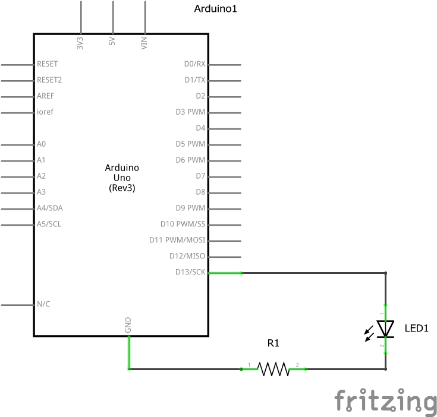
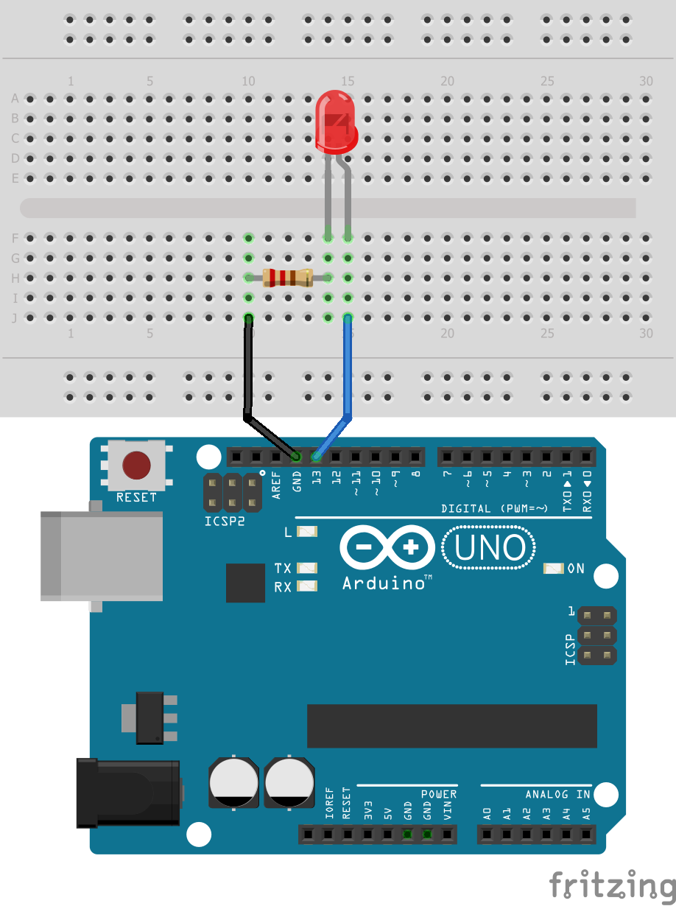
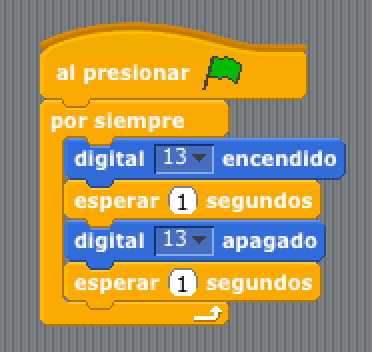

#Led intermitente

Sencillo proyecto consistente en un LED que parpadea continuamente con una frecuencia de 1 segundo.

1.	[Materiales](#materiales)
2.	[Diagrama de flujo](#diagrama-de-flujo)
3.	[Esquema eléctrico](#esquema-eléctrico)
4.	[Diseño eléctrico](#diseño-eléctrico)
5.	[Programación por bloques](#programacion-por-bloques)
6.	[Programación en Arduino](#programación-en-arduino)


## Materiales

- 1 Placa de Arduino UNO
- 1 Protoboard
- 2 latiguillos
- 1 Led
- 1 Resistencia


## Diagrama de flujo


## Esquema eléctrico

En primer lugar tenemos que calcular el valor de la resistencia teniendo en cuenta los siguientes datos:

```
V = I x R

V = 5V
I = 20mA
```

Redondeando la división obtenemos una resistencia de 220Ω, que mirando en la tabla de resistencias corresponde a la resistencia de color rojo-rojo-marrón.




## Diseño eléctrico

A continuación construímos el circuito sobre la placa de prototipado utilizando los materiales vistos en el apartado anterior.




## Programación por bloques

Fijándonos en el diagrama de flujo programamos la práctica mediante lenguaje de bloques.




## Programación en arduino

Fijándonos en el diagrama de flujo programamos la práctica mediante lenguaje de processing.

```
/**
 * Led Intermitente con frecuencia de 1 segundo
 * 
 * @author Miguel Ángel Abellán
 * @company Programo Ergo Sum
 * @license Creative Commons. Reconocimiento CompartirIgual 4.0
 */

//Se define la variable ledPin y delayTime
int ledPin = 13;
int delayTime = 1000;

//Este código se ejecuta la primera vez
void setup() {
  pinMode(ledPin, OUTPUT);
}

//Este código se ejecuta en bucle repetidamente
void loop() {
  digitalWrite(ledPin, HIGH);
  delay(delayTime);
  digitalWrite(ledPin, LOW);
  delay(delayTime);
}

```


=============

#### Licencia

 Esta obra se distribuye bajo licencia [Reconocimiento-CompartirIgual 4.0 Internacional (CC BY-SA 4.0)](https://creativecommons.org/licenses/by-sa/4.0/deed.es_ES).
