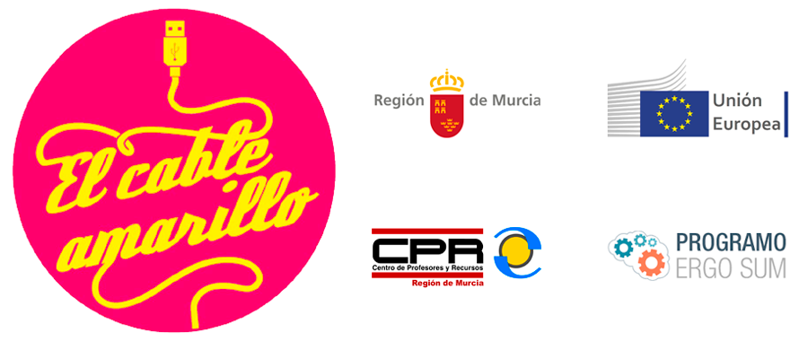

# Programa Educativo "El Cable Amarillo"

 
*Fondo Europeo de Desarrollo Regional - Una manera de hacer Europa*

### Normativa

[Resolución de 24 de junio de 2016, de la Dirección General de Innovación Educativa y Atención a la Diversidad, por la que se convoca el Programa Educativo El Cable Amarillo, para el curso 2016/2017. (Publicado en Tablón de Anuncios 11/07/2016)](http://servicios.educarm.es/templates/portal/ficheros/websDinamicas/45/Convocatoria%20curso%202016-17%20CI%2075926%2011-07-16.pdf)

## Objetivos del programa

1.	Potenciar el **razonamiento lógico-matemático** de los alumnos de la ESO mediante el uso de estructuras básicas de la programación informática.
2.	Contribuir a la adquisición de la competencia digital así como a la competencia matemática y las **competencias básicas en ciencia y tecnología** de los alumnos.
3.	Utilizar la robótica y las técnicas de programación como un **recurso transversal** a las diferentes materias de la ESO.
4.	Establecer espacios de intercambio, difusión de experiencias y buenas prácticas en **innovación educativa**, entre los alumnos, docentes y centros educativos de la Región de Murcia.
5.	Realizar **proyectos colaborativos** de robótica entre diferentes centros de la Región.

## Contenido

1.	[Listado de materiales](Materiales/)
2.	[Introducción a los lenguajes de Programación](Programación/)
3.  [Introducción a la electrónica con Arduino](Arduino/)
4.  [Sesiones de Formación CPR Murcia](Formación/)
5.  [Prácticas para realizar en el aula](Prácticas/)

=============

#### Licencia

 Esta obra se distribuye bajo licencia [Reconocimiento-CompartirIgual 4.0 Internacional (CC BY-SA 4.0)](https://creativecommons.org/licenses/by-sa/4.0/deed.es_ES).