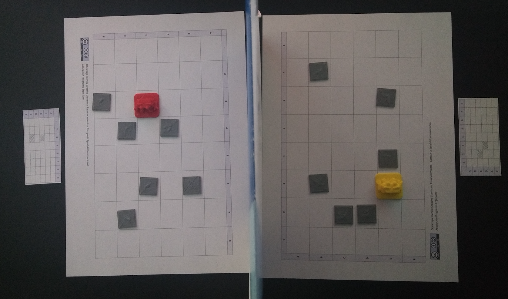

# Aprende a programar sin ordenador

> En construcción

# Resumen del juego

Cada jugador tendrá que atravesar el tablero evitando los obstáculos ocultos. Para ello deberás guiar a tu robot utilizando solamente 3 movimientos **adelante**, **gira a la derecha** y **gira a la izquierda**. Cada vez que te encuentres con un obstáculo será el turno de tu contrincante. El primero que logre atravesar el tablero gana la partida.

### Preparación de la partida

Cada jugador dispone de un tablero el cual no podrá ver su contrincante. Deberá colocar 10 obstáculos de forma aleatoria. La única condición es que **tiene que haber un camino posible** para que se pueda atravesar conociendo los movimientos del robot.

### Desarrollo de la partida

Empieza el *jugador 1* indicando a su contrincante en qué fila quiere colocar a su robot, por ejemplo, en la posición **1B** y éste le contestará si puede colocarlo o no. En caso de poder colocarlo, continuará indicando el siguiente movimiento, por ejemplo, **avanza**. Y nuevamente el contrincante le indicará si puede continuar o no. Este proceso se repetirá hasta que no pueda avanzar por encontrar un obstáculo, en cuyo caso será el turno para el *jugador 2*.

Para facilitar la partida, se cuenta con unas fichas individuales donde podrás apuntar tus obstáculos y evitarlos en tu siguiente turno de la partida.

El primero que logre atravesar el tablero ganará la partida.

## Agradecimientos

A <a target="_blank" href="https://twitter.com/gorkaprofe">Gorka</a> por compartir las actividades realizadas en su clase.

<blockquote class="twitter-tweet" data-lang="es">
Otro ejemplo más desarrollando Pensamiento Computacional con actividades de <a href="https://twitter.com/hashtag/programaci%C3%B3n?src=hash&amp;ref_src=twsrc%5Etfw">#programación</a> unplugged, sin ordenador. <a href="https://twitter.com/hashtag/Rob%C3%B3ticaPorLaIgualdad?src=hash&amp;ref_src=twsrc%5Etfw">#RobóticaPorLaIgualdad</a> <a href="https://twitter.com/hashtag/Educaci%C3%B3n?src=hash&amp;ref_src=twsrc%5Etfw">#Educación</a> <a href="https://t.co/q5hqH33nuG">pic.twitter.com/q5hqH33nuG</a>
&mdash; Gorka García ن (@Gorkaprofe) <a href="https://twitter.com/Gorkaprofe/status/1079352225430978562?ref_src=twsrc%5Etfw">30 de diciembre de 2018</a></blockquote>

A <a target="_blank" href="https://twitter.com/carmenb_mg">Carmen</a> por la inspirarme en la idea de juego en parejas. 

Piezas impresas en 3D tomadas de <a target="_blank" href="https://www.thingiverse.com/thing:2660513">netdreamer</a> mientras se crea una personalizada :). 
