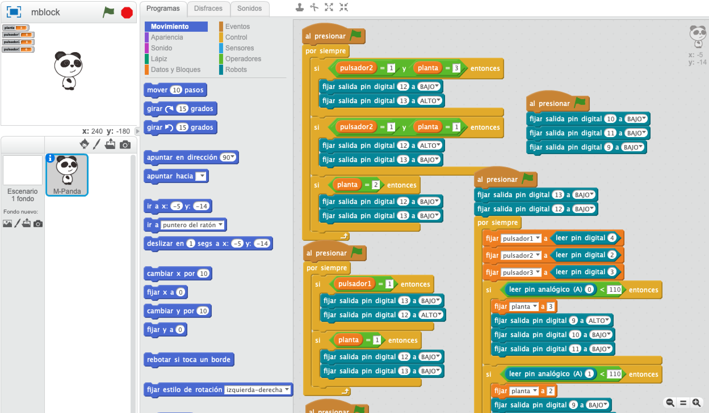

# Ascensor con indicadores luminosos

Se trata de un proyecto realizado por alumnos de 3º de ESO coordinados por la profesora Mª Inmaculada Sánchez Conesa.
El ascensor consta de tres plantas. Cada planta dispone de una fotorresistencia LDR.

Hay tres pulsadores. Cada uno va acompañado de un indicador luminoso, que nos permite conocer en todo momento donde se encuentra el ascensor.

El movimiento del ascensor se realiza con un mecanismo reductor de velocidad y un sistema simple de poleas, alimentado por una pila de 9v. La inversión de giro del motor se consigue con un puente H usando un driver L293D.

## Materiales

El ascensor está ubicado en una planta, por lo que el indicador luminoso de dicha planta está activo. Cuando accionamos otro pulsador, el ascensor se dirige a la planta indicada. En el momento en que el LDR deja de detectar la cabina se apaga ese led, y conforme es detectado por el LDR de otra planta se enciende el correspondiente led.

- Maqueta de ascensor
- Placa Arduino
- Placa protoboard
- Cable USB
- Cables macho y cables hembra para arduino
- Resistencias LDR
- Resistencias de 220 Ω y 10 K 
- Mecanismo reductor de velocidad y sistema simple de poleas
- Diodos led
- L293D
- Pila de 9v

## Programación en mBlock

