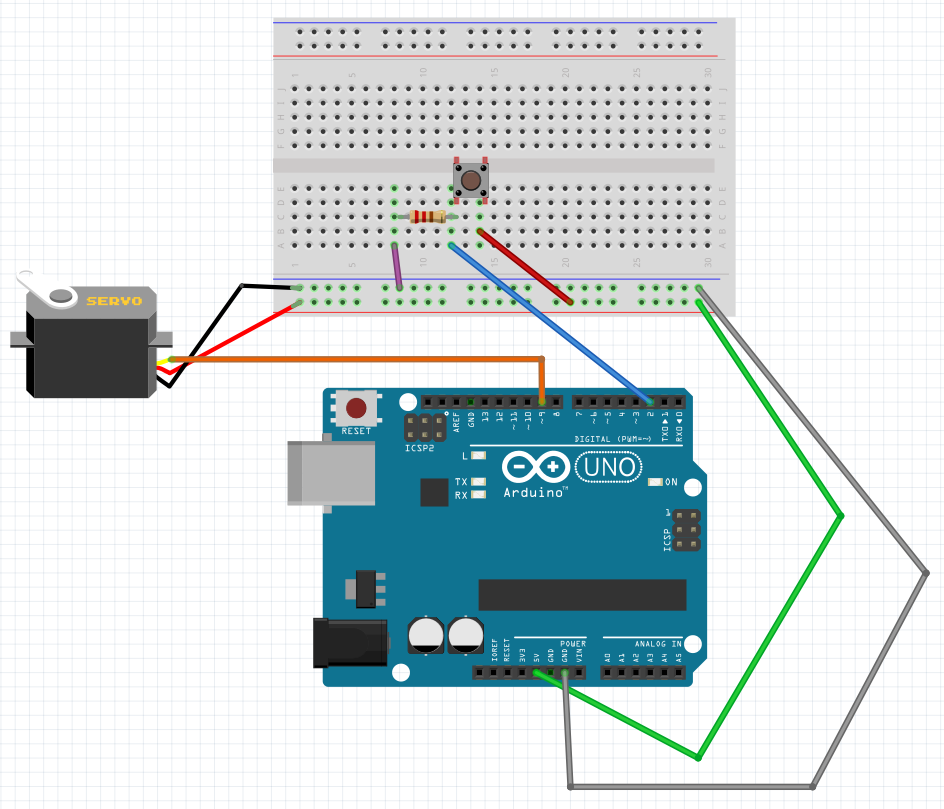
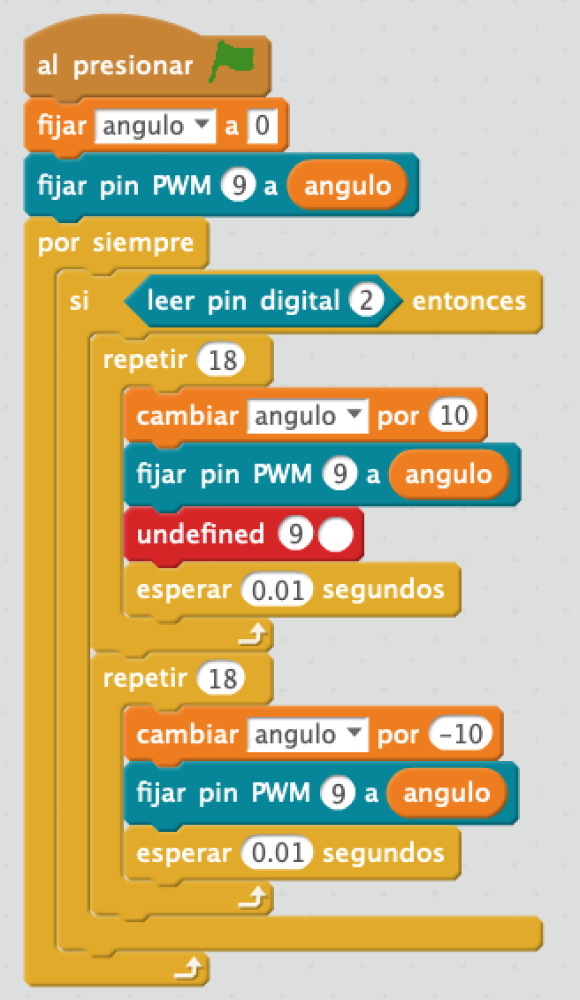

# Bye Bye

La plantagoshi conecta una maceta a su entorno. Avisa al dueño mediante scratch de cuando tiene que regar, abrigar o cambiar su iluminación.

## Materiales

- 1 Arduino UNO
- 1 Protoboard
- 4 Latiguillos
- 1 Resistencias de 220 Ohm 
- Servomotor SG90

## Esquema eléctrico

## Programación en mBlock

