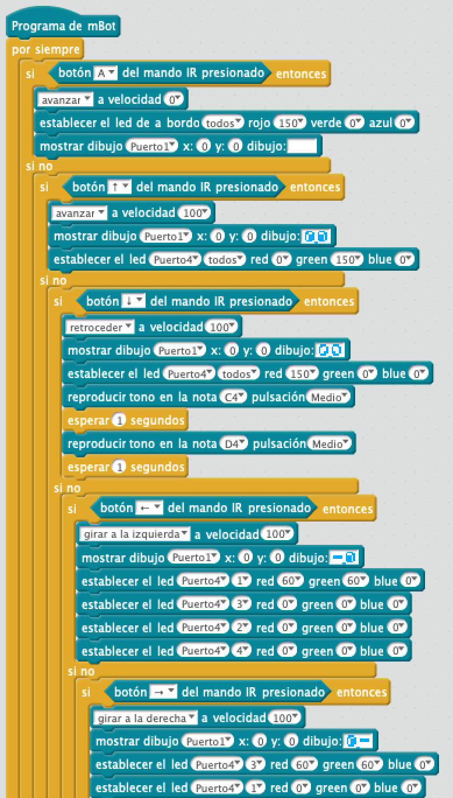

# Coche con mando

Control de mBot con mando. Indicación de marcha a delante con carita en la pantalla led y los  RGB traseros en verde.

Indicación de marcha atrás con carita sorpresa RGB en rojo y Zumbador activado.

Indicador de giro: la carita cierra el ojo hacia donde gira y también es indicado por los RGB traseros

## Materiales

- 1 Robot mBot

## Programación en mBlock

