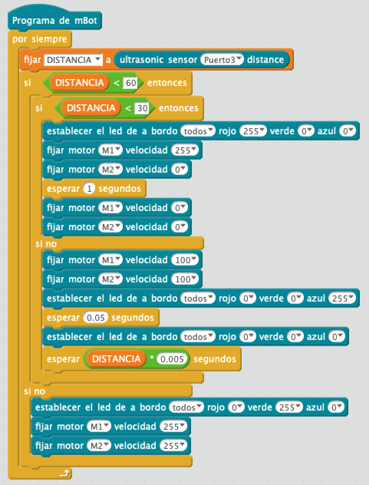

# Robot detector de alumnos

El robot, siempre avanzando en línea recta y con la verde encendida, es capaz de detectar objetos, parados o en movimiento, si se encuentran a menos de 60 cm.

Cuando detecta un objeto situado entre 60 cm y 30 cm apaga la luz verde, disminuye la velocidad, enciende la azul de forma intermitente y el robot sigue avanzando en línea recta. 

Si el objeto se encuentra a menos de 30 cm el robot apaga luz azul, enciende la luz roja, gira y continúa avanzando en otra dirección.

## Materiales

- 1 Robot mBot

## Programación en mBlock

