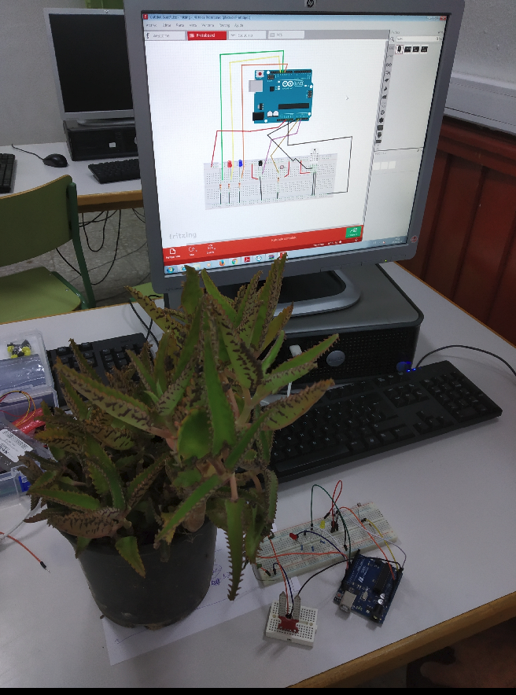
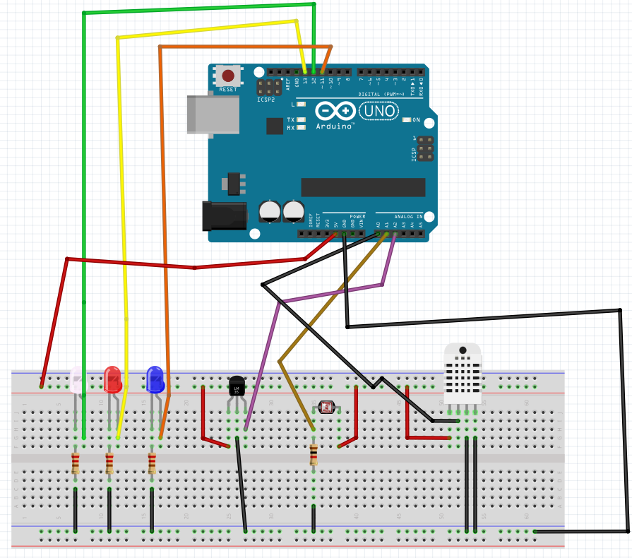
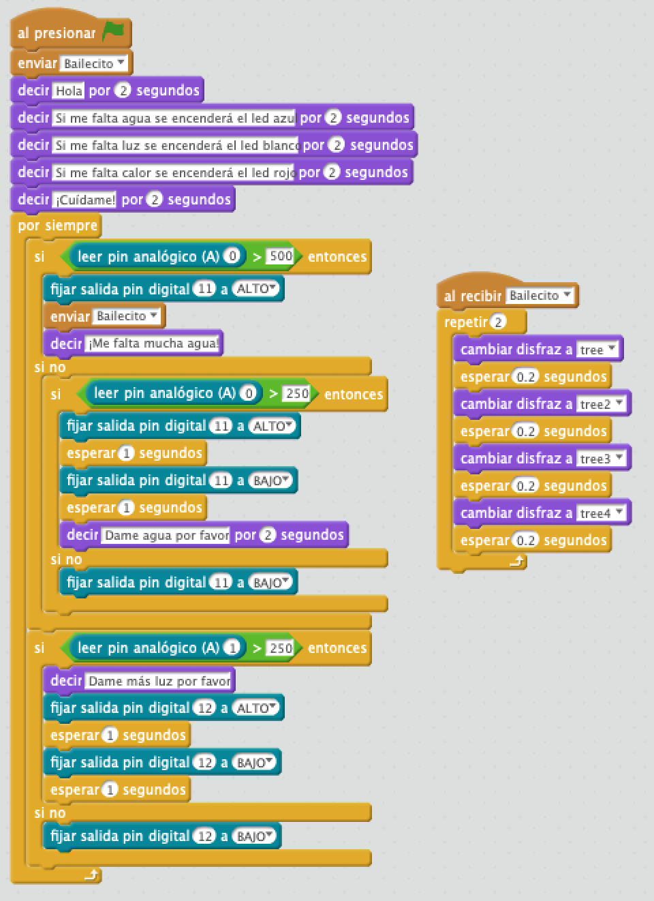

# Plantagoshi

La plantagoshi conecta una maceta a su entorno. Avisa al dueño mediante scratch de cuando tiene que regar, abrigar o cambiar su iluminación.

## Materiales

- 1 Arduino UNO
- 1 Protoboard
- 4 Latiguillos
- 3 Diodos Leds
- 3 Resistencias de 220 Ohm 
- Sensor de humedad
- Sensor de temperatura
- Sensor de luz LDR

## Esquema eléctrico

## Programación en mBlock

