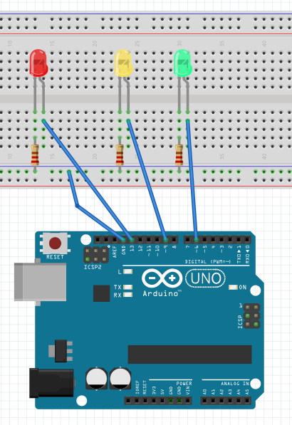
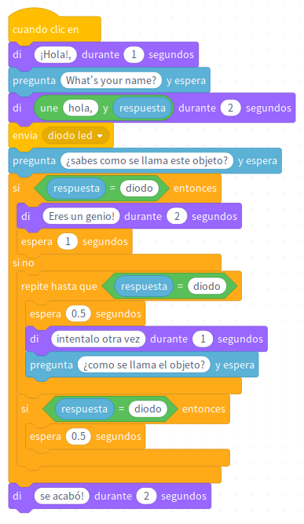

# Preguntar con arduino

Consiste en un ejercicio en donde el alumno desarrolla un programa donde el personaje de mblock le pregunta como se llama y después de dar el alumno su nombre, se le muestra un diodo. Si acierta a la primera se le enciende un diodo verde y se acaba el programa, si no, le pide que escriba el nombre correcto y mientras no lo hace se le enciende un diodo rojo, después de decir la respuesta correcta, se enciende el diodo amarillo y se acaba el programa.

**Nivel educativo**: tarea de clase para 2º de eso en la materia de robótica

## Materiales

- 1 Arduino UNO
- 1 Protoboard
- 4 Latiguillos
- 3 Diodos Leds
- 3 Resistencias de 220 Ohm 

## Esquema eléctrico

Para la conexión de los leds, se van a utilizar los pines digitales 13, 9 y 6 de nuestar placa de Arduino.

## Programación en mBlock

Mediante la función "Envía diodo led" activamos el led necesario del juego.

