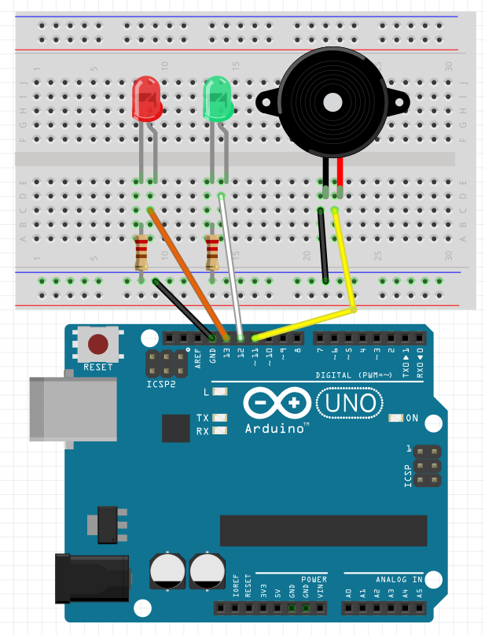
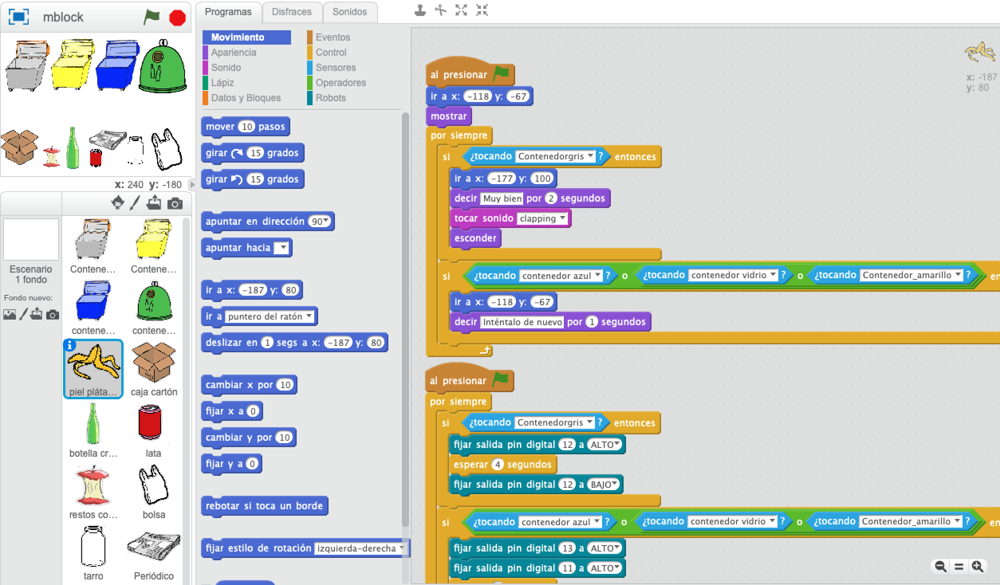

# Reciclaje

Consiste en desechar cada residuo en el contenedor adecuado. Si aciertas se encenderá la luz verde y si fallas se encenderá la roja y se oirá un pitido.

## Materiales

- 1 Arduino UNO
- 1 Protoboard
- 4 Latiguillos
- 2 Diodos Leds
- 2 Resistencias de 220 Ohm 
- 1 Zumbador

## Esquema eléctrico

## Programación en mBlock

