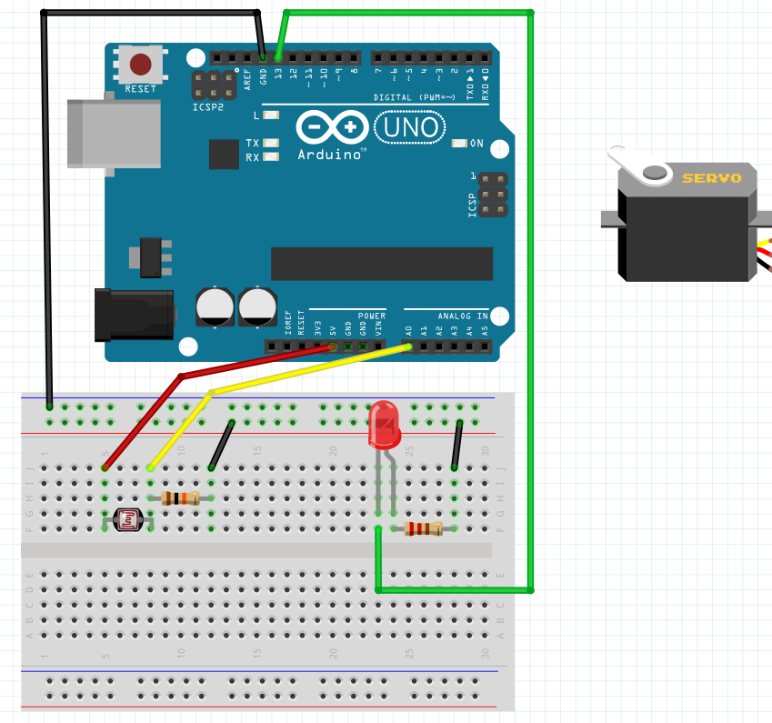
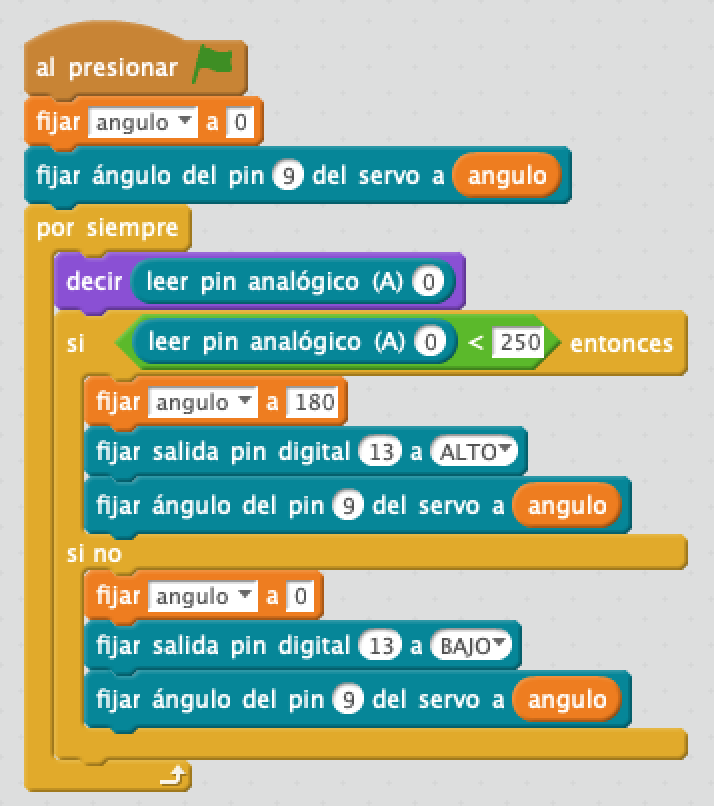

# Sensor baja toldo

## Materiales

- 1 Placa de Arduino
- 1 Protoboard
- 8 Latiguillos (macho-macho)
- 1 Leds
- 2 Resistencias
- 1 Sensor LDR
- 1 Servomotor

## Esquema eléctrico

## Programación en mBlock

