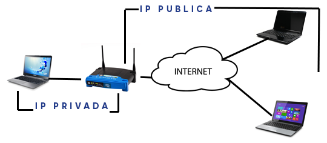
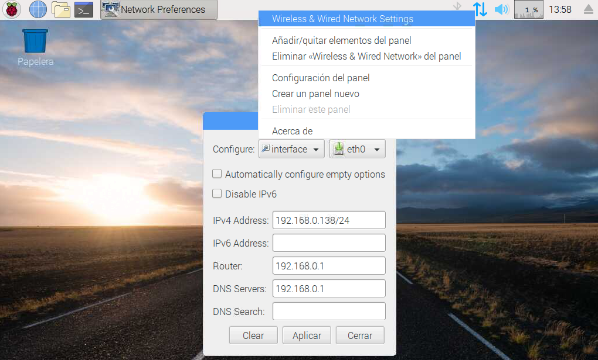

# Direcciones IP

Una dirección IP (Internet Protocol) es la dirección de red a la cual está conectado un equipo. Vendría a ser algo similar a la dirección de nuestra casa, pero utilizando números `xxx.xxx.xxx.xxx`. 

Cada vez que nos conectamos a un router, ya sea por cable o wifi, puede que nuestro router nos otorgue una *dirección IP privada o local* distinta. La IP se asigna de forma dinámica proporcionada por el DHCP (Dynamic Host Configuration Protocol). En este caso nuestro router hace de servidor DHCP y nos asigna una dirección IP dentro de un rango de direcciones, por ejemplo la dirección `192.168.0.138`.

Lo mismo pasa con nuestro proveedor de internet ISP, cada vez que reiniciamos el router puede que tengamos una *dirección IP pública* distinta.

Sin embargo, si tenemos una instalación permanente (servidor de archivos, sistema de videovigilancia, etc.) vamos a querer que la dirección IP sea fija.

## Establer IP Fija en Rasperry Pi

Nuestro objetivo será acceder a la propia Raspberry Pi de forma remota, pero para ello debemos establer una dirección IP fija que nunca cambie aunque reiniciemos el sistema.

> Para configurar una IP fija debemos asegurarnos que esté fuera del rango DHCP (configuración del router) y que ningún otro dispositivo tenga asignada la misma dirección IP.

La forma más sencilla de establer una dirección IP desde Raspbian es desde el entorno gráfico. Para ello haciendo doble clic sobre el icono de `configuración de red`, seleccionamos la interfaz `eth0` si estamos conectados por cable de red o `wifi` en caso de estar mediante wifi.

Añadimos la dirección IP que tengamos libre y permitida en nuestro router. Añadimos también la máscara de red o router y también podemos añadir unas DNS de nuestro router o públicas.

- `IPv4`: Dirección IP fija que queremos (dejar el /24 al final)
- `Router`: Dirección IP del router
- `DNS Servers`: Dirección del servidor DND (la del router)

A continuación guardamos los cambios y reiniciamos la Raspberry Pi para ver que los cambios son correctos. Al reiniciar, volvemos a acceder a la configuración de red y veremos que la IP está guardada.
