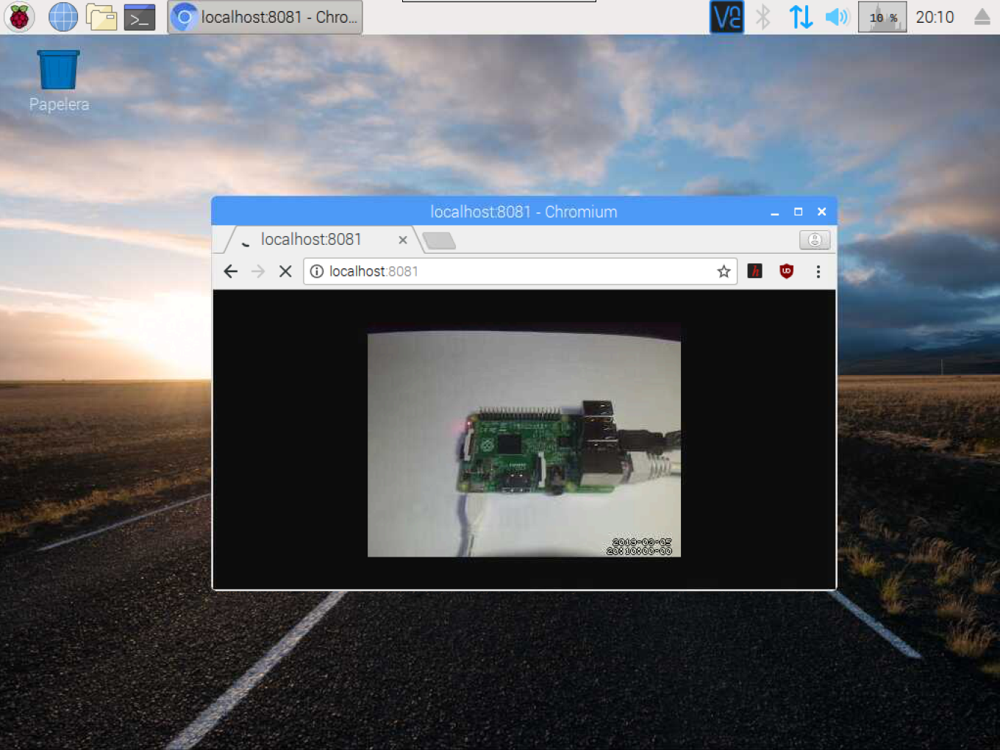

# Detecta movimientos con una webcam y Motion en Raspberry Pi

[Motion](https://motion-project.github.io/) es uno de los programas más populares para utilizar con webcams, cuya utilidad es la de detectar movimientos. De esta forma podemos grabar momentos en los cuales se ha detectado movimiento. 

> Recordamos que antes de instalar Motion debemos asegurarnos que nuestra webcam ha sido reconocida por el Sistema Operativo como se explica en el tutorial [Raspberry Pi - Webcam - LUVCview](raspberry_pi-webcam-luvcview)

## Instalar Motion

> Recordamos que antes de instalar cualquier software es conveniente tener actualizado el listado de repositorios con el comando `apt-get update` como se explica en el tutorial [Raspberry Pi - Raspbian - Update](raspberry_pi-raspian-update)
 
Una vez actualizada la lista de paquetes del repositorio, podemos instalar Motion mediante el comando `apt-get install motion`.

```sh
pi@raspberrypi:~ $ sudo apt-get install motion
```

Para comprobar que se ha instalado correctamente, abrimos un navegador en la misma Raspberry Pi, accedemos a la dirección `localhost:8081` y se debe ver la webcam.


