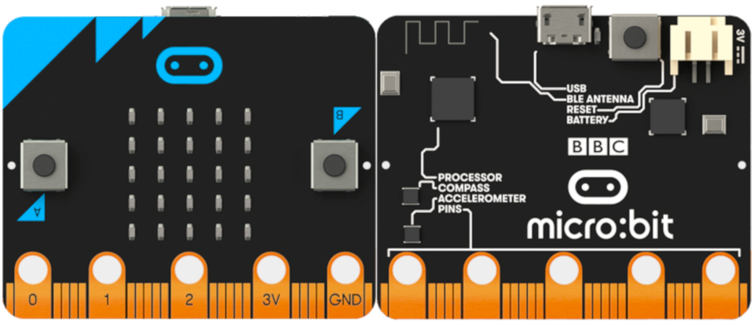
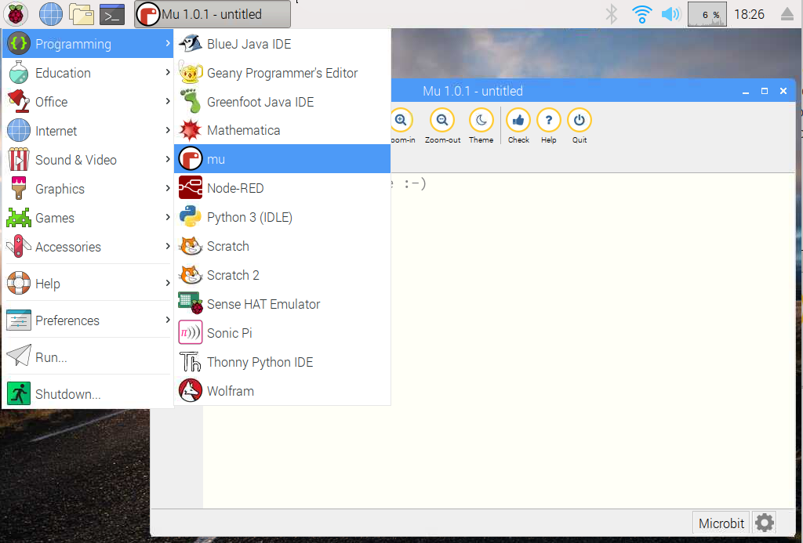
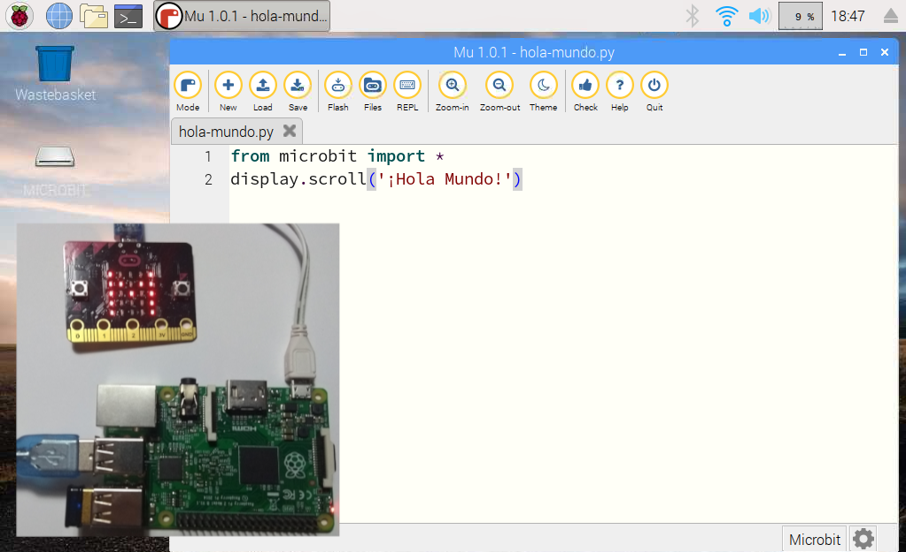

# Primeros pasos con micro:bit y Mu Editor

[BBCs Micro:bit](https://microbit.org/es/) es una pequeña placa de electrónica programable diseñada para aprender a programar de forma sencilla. Cuenta con diferentes sensores y actuadores con los que poder interactuar mediante programación. Y para programarla vamos a utilizar el editor Mu. [Mu Editor](https://codewith.mu/) es un editor de Python muy sencillo para principantes de la programación. 



## Instalar Mu Editor

> Recordamos que antes de instalar cualquier software es conveniente tener actualizado el listado de repositorios con el comando `apt-get update` como se explica en el tutorial [Raspberry Pi - Raspbian - Update](raspberry_pi-raspian-update)

Una vez actualizada la lista de paquetes del repositorio podemos instalar el editor desde la terminal mediante el comando `apt-get install mu`. El proceso suele tardar unos minutos.

```sh
pi@raspberrypi:~ $ sudo apt-get install mu
...
Do you want to continue? [Y/n] Y
...
```

Una vez instalado ya podemos acceder al editor desde el menú `Inicio > Programming > Mu`



## Conectar Micro:bit a Raspberry Pi

Para conectar la placa hacemos uso de cualquiera de los USB disponibles en la Raspberry Pi. Al conectarla aparecerá una ventana indicando que se ha introducido un dispositivo nuevo. Simplemente cancelamos la ventana haciendo clic en el botón `Cancelar`.

## Programación en MicroPython

[MicroPython](http://micropython.org/) es una versión reducida de Python 3 diseñada para funcionar en microcontroladores, como es el caso de la placa micro:bit.

Una vez abierto el editor y conectada la placa Micro:bit, vamos a probar que funciona introduciendo el programa `Hola Mundo`. Para ello introducimos el siguiente código y presionamos sobre el botón `Flash`. Al cabo de unos segundos veremos como se desliza la frase `¡Hola Mundo!` sobre los leds de nuestra Micro:bit.

```python
from microbit import *
display.scroll('¡Hola Mundo!')
```


