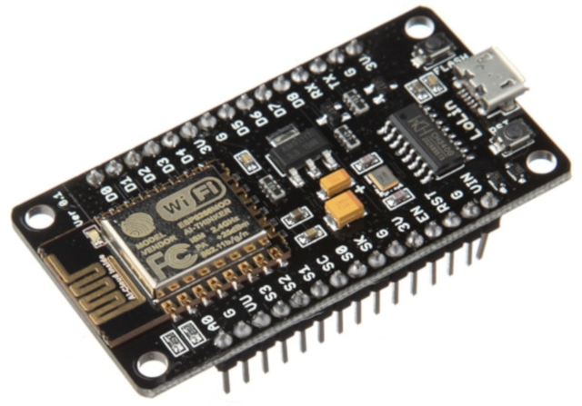
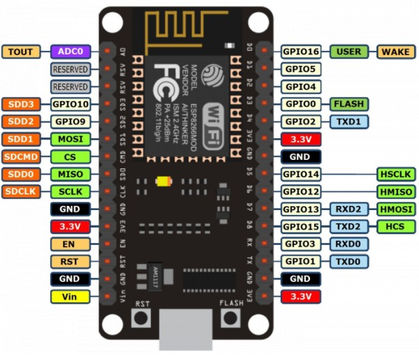

En este tutorial vamos a explicar las **principales características de la placa de desarrollo NodeMCU** para posteriormente utilizarla en proyectos educativos a través de dispositivos conectados.

- [Kit de desarrollo NodeMCU](#kit-de-desarrollo-nodemcu)
  - [NodeMCU Lolin / Wemos](#nodemcu-lolin--wemos)
  - [Pines NodeMCU](#pines-nodemcu)
- [Resumen](#resumen)
- [Ejercicios propuestos](#ejercicios-propuestos)

# Kit de desarrollo NodeMCU

NodeMCU es una placa de desarrollo de hardware y software abierto utilizada principalmente en el internet de las cosas (IoT - Internet of Things). Al igual que ocurre con otras placas similares, como el Arduino MKR1000, todo está dispuesto para que pueda ser programado de una forma sencilla.

NodeMCU incorpora un módulo, dentro de este, un chip SoC, y dentro de este, un microcontrolador MCU.

- Módulo ESP-12 o ESP-12E. Encargado de procesar la información que utiliza la placa.
- SoC (System on a Chip) ESP8266. Es un módulo WiFi de 2,4GHz compatible con la mayoría de routers del mercado.
- Microcontrolador MCU Tensilica de 32-bit. Encargado de ejecutar las sentencias del programa y gestionar las entradas y salidas de los pines GPIO.

> Todos los NodeMCU se basan en los mismos módulos ESP-12 y ESP-12E, que se a su vez se basan en el SoC ESP8266.

## NodeMCU Lolin / Wemos

Como hemos comentado anteriormente, NodeMCU es hardware abierto con lo cual encontrarás diferentes modelos de diferentes fabricantes, aunque todos ellos incluyen el mismo módulo y SoC.

En este tutorial vamos a utilizar la placa de desarrollo `NodeMCU Lolin / Wemos v3`.

## Pines NodeMCU

ToDo

Una vez vista la placa NodeMCU vamos a ver una visión general de la distribución de los pines. 

- El pin A0 es el destinado a entrada analógica. Rango de tensión de 0V-3.3V (valor 0-1023).
- Los pines GPIO (General Purpose Input/Output) son los destinados a entradas y salidas digitales.

---

# Resumen

NodeMCU es una placa de hardware libre similar a Arduino MKR1000, con la diferencia que es mucho más económica, ya que podemos encontrarla por 7€ aproximadamente.

Sin embargo, la documentación no es tan extensa y clara como ocurre con las placas de Arduino que todo aparece bien documentado.

---

# Ejercicios propuestos

1.- ToDo

