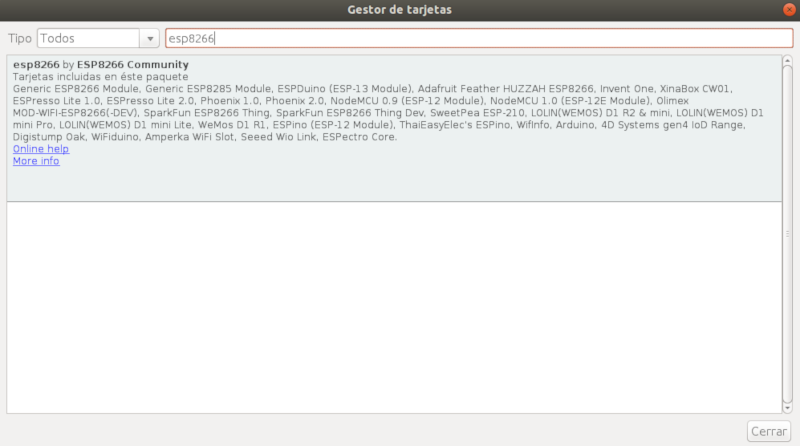

# Programar ESP8266 con el IDE de Arduino

En este tutorial vamos a cómo configurar el IDE de Arduino para programar con la ESP8266.

## Instalar Arduino IDE

Lógicamente lo primero que tenemos que hacer es descargar el *IDE de Arduino* desde la web oficial.

```
URL: https://www.arduino.cc/en/Main/Software
```

## Agregar tarjeta ESP8266 en el IDE de Arduino

Agregar la ESP8266 sobre el IDE de Arduino es muy sencillo gracias al soporte de la comunidad que hace que esté disponible como paquete. Con lo cual lo que tenemos que hacer es importar dicho paquete sobre el IDE de Arduino accediendo a `Archivo > Preferencias` y añadimos la ruta en `Gestor de URLs Adicionales de Tarjetas` donde se cuentra el paque del ESP8266.

```
URL: http://arduino.esp8266.com/stable/package_esp8266com_index.json
```


Una vez añadido el paquete, instalamos la placa accediendo al menú `Herramientas > Placas > Gestor de placas`. A continuación buscamos la placa `esp8266` y la instalamos. Este proceso tardará unos minutos.



Al finalizar el proceso de instalación ya podemos seleccionar la placa `NodeMCU 1.0 (ESP 12E Module)` y el puerto al cual tengamos conectada nuestra ESP.
