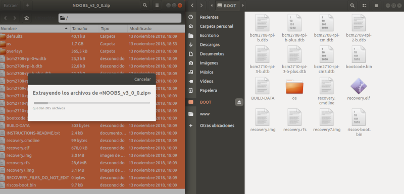

En este tutorial vamos a explicar cómo **instalar el sistema operativo Raspbian en Raspberry Pi** utilizando el asistente guiado NOOBs.

- [Instalar Raspbian en Raspberry Pi con NOOBs](#instalar-raspbian-en-raspberry-pi-con-noobs)
  - [Requisitos](#requisitos)
  - [Descargar Raspbian con NOOBs](#descargar-raspbian-con-noobs)
  - [Instalar SD Card Formatter](#instalar-sd-card-formatter)
  - [Instalar Raspbian con NOOBs](#instalar-raspbian-con-noobs)
- [Resumen](#resumen)
- [Ejercicios propuestos](#ejercicios-propuestos)

# Instalar Raspbian en Raspberry Pi con NOOBs

NOOBS es el acrónimo de *New Out Of Box Software* y consiste en un instalador sencillo guiado paso a paso. NOOBS incluye también un método de edición rápida de configuración del nuevo sistema, un navegador web preinstalado y un modo de recuperación por línea de comandos a partir de una partición de rescate que se crea automáticamente.

## Requisitos

Debemos disponer de los siguientes componentes:

- PC con conexión a internet
- Lector de tarjetas SD

## Descargar Raspbian con NOOBs

Para descargar la imagen del sistema operativo Raspbian accederemos al apartado de [descargas](https://www.raspberrypi.org/downloads/noobs/) de la web oficial de Raspberry Pi y elegimos la versión que queremos instalar.

- `NOOBS`: Versión completa con entorno gráfico y programas recomendados.
- `NOOBS Lite`: Versión reducida sin entorno gráfico (modo consola).

> El archivo descargado vendrá con extensión `.zip` con lo cual deberemos tener instalado un compresor de archivos.

## Instalar SD Card Formatter

Mientras se descarga la imagen de Raspbian, vamos a descargar el programa [SD Card Formatter](https://www.sdcard.org/downloads/index.html) (recomendado por Raspberry Pi) que utilizaremos para formatear y dejar preparada la tarjeta SD. 

## Instalar Raspbian con NOOBs

Una vez descargada la imagen de Raspbian, la descomprimimos con un compresor de archivos `.zip` y copiamos todos los archivos en la tarjeta SD previamente formateada.

Una vez copiados todos los archivos, conectaremos nuestra Raspberry Pi e iremos seleccionando las opciones que nos ofrezca el asistente de instalación. Este proceso suele tardar 20 minutos aproximadamente.

Una vez finalizada la instalación arrancará el sistema operativo Raspbian.

---

# Resumen

Una forma sencilla de instalar Raspbian es copiando todos los archivos de la imagen descargada desde la página oficial de Raspberry Pi y seguir el asistente guiado de instalación.

---

# Ejercicios propuestos

1.- Instala el sistema operativo Raspbian a partir de una imagen utilizando el asistente NOOBs. Además deberás calcular el tiempo aproximado de la instalación de los diferentes programas utilizados.

|                          | Tiempo |
| ------------------------ | ------ |
| Descargar NOOBs          |        |
| Copiar archivos en la SD |        |
| Instalar NOOBs           |        |
| TIEMPO TOTAL             |        |
