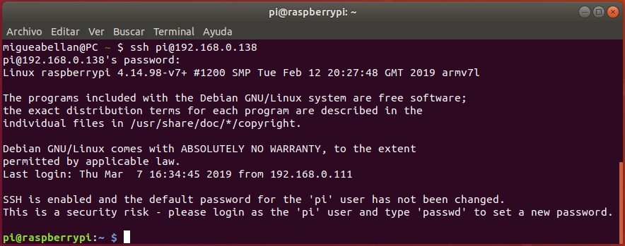
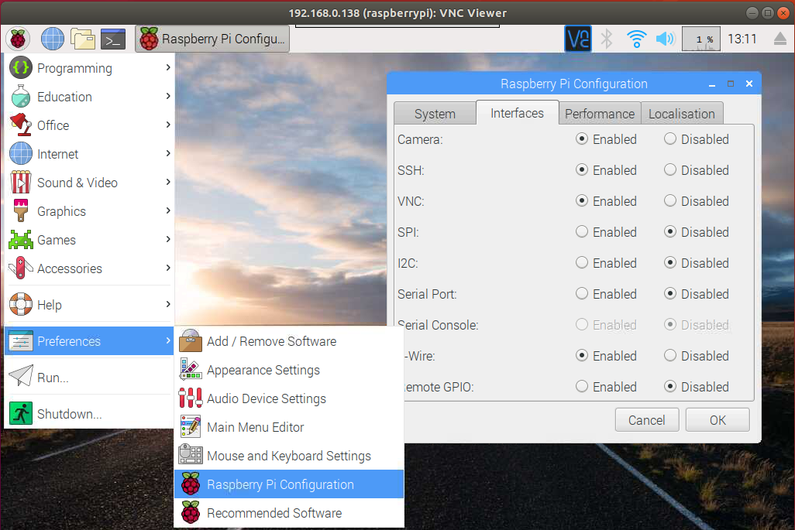
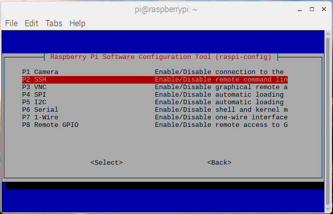

# Acceso remoto a través de Secure Shell (SSH)

Secure Shell (SSH) es un **protocolo de comunicación entre dos sistemas usando una arquitectura cliente/servidor y que permite a los usuarios conectarse a un host remotamente**. La sesión de conexión está encriptada haciendo imposible que alguien pueda obtener contraseñas no encriptadas.

En la siguiente imagen podemos ver una ventana típica de conexión SSH a una Raspberry Pi con el sistema operativo Raspbian Stretch.



Los usuarios con sistemas operativos *Linux* o *MAC* pueden utilizar la propia terminal mientras que los usuarios de *Windows* deben **instalar un cliente SSH** como [Putty](https://www.putty.org/).

## Habilitar SSH en la Raspberry Pi

La conexión por SSH a la raspberry Pi viene deshabilitada por defecto cuando instalamos el sistema operavico Raspbian Stretch. Con lo cual, lo primero que tenemos que hacer es habilitarla y ee puede habilitar desde el **entorno gráfico** o **desde la terminal**.

### Desde el entorno gráfico

Accedemos al menú `Inicio > Preferencias > Raspberry Pi Configuración` y una vez en la ventana de configuración, sobre la pestaña `Interfaces` habilitamos la opción `SSH`. A continuación guardamos y ya está habilitado el acceso por SSH.



### Desde la terminal

Accedemos a la terminal e introducimos el comando `sudo raspi-config`. Seleccionamos la opción de `Interfaces`, a continuación la opcción de `SSH` y por último la opción de `Habilitar`. Guardamos y ya está habilitado el acceso por SSH.




## Acceder por SSH desde un ordenador

El comando para conectar por SSH `ssh user@host` consta de 3 partes:

- **ssh**: Indica que se establecerá una conexión segura y cifrada por SSH
- **user**: Usuario del host remoto con el cual se establecerá la conexión
- **host**: Dirección IP o dominio de la máquina a la cual nos vamos a conectar

Por ejemplo, voy a conectarme por SSH utilizando el usuario por defecto `pi`, a la Raspberry Pi con dirección IP `192.168.0.138`. Y cuando nos solicite el password introducimos la contraseña por defecto `raspberry`

```sh
migueabellan@PC ~ $ ssh pi@192.168.0.138
pi@192.168.0.138's password: *********
```

Una vez establecida la conexión SSH nos aparecerá el **prompt** `pi@raspberrypi:~ $ ` el cual indica que estamos conectados con el usuario `pi` a la máquina `raspberrypi`

```sh
migueabellan@PC ~ $ ssh pi@192.168.0.138
pi@192.168.0.138's password: 
Linux raspberrypi 4.14.98-v7+ #1200 SMP Tue Feb 12 20:27:48 GMT 2019 armv7l

...

pi@raspberrypi:~ $ 
```

### Establecer clave ssh 

ToDo

```sh
pi@raspberrypi:~ $ ssh-keygen
```


Para conectarte desde fuera de la red local puedes hacerlo a través de [OpenVPN](raspberry_pi-openvpn)