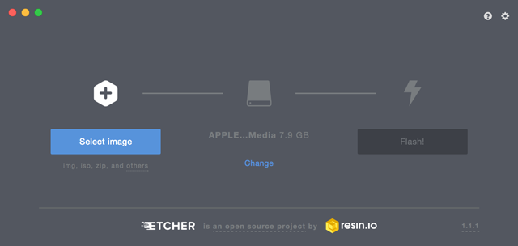

En este tutorial vamos a explicar cómo **instalar el sistema operativo Raspbian en Raspberry Pi** utilizando el clonado de una imagen con Etcher.

## Antes de empezar

Vas a necesitar los siguientes componentes:

- Raspberry Pi
- PC con conexión a Internet
- Lector de tarjetas SD

- [Raspbian Etcher](#raspbian-etcher)
  - [Descargar imagen de Raspbian](#descargar-imagen-de-raspbian)
  - [Instalar Etcher](#instalar-etcher)
  - [Clonar la imagen con Etcher](#clonar-la-imagen-con-etcher)
- [Resumen](#resumen)
- [Ejercicios propuestos](#ejercicios-propuestos)

# Raspbian Etcher

Raspbian es el sistema operativo recomendado para Raspberry Pi (al estar optimizado para su hardware) y se basa en una distribución de GNU/Linux llamada Debian.

Una imagen es un archivo que contiene la estructura y los contenidos completos de un sistema operativo, es decir, una copia exacta del sistema operativo y contenido. Esto es útil cuando queremos que todos nuestros equipos dispongan de la misma configuración y con los mismos programas instalados, mismas carpetas, etc.

## Descargar imagen de Raspbian

Para descargar la imagen del sistema operativo Raspbian para Raspberry Pi accederemos al apartado de [descargas](https://www.raspberrypi.org/downloads/raspbian/) y elegimos la versión a instalar. El tiempo de descarga suele ser de 10 minutos aproximadamente dependiendo de la conexión a internet.

- `Raspbian Stretch with desktop and recommended software`: Versión completa con entorno gráfico y programas recomendados.
- `Raspbian Stretch with desktop`: Versión completa con entorno gráfico (ventanas, carpetas, etc.).
- `Raspbian Stretch Lite`: Versión reducida sin entorno gráfico (modo consola).

## Instalar Etcher

La imagen del sistema operativo se instalará sobre una tarjeta SD. Por ello, mientras se descarga la imagen de Raspbian, vamos a descargar e instalar el programa [Etcher](https://etcher.io/) (recomendado por Raspberry Pi) que utilizaremos para copiar la imagen de Raspbian en la tarjeta SD.

## Clonar la imagen con Etcher

Una vez descargada la imagen de Raspbian e instalado el programa Etcher, lo abrimos y seleccionamos la imagen y la tarjeta donde queremos copiar el sistema operativo. Hacemos clic en `Flash` y esperamos a que el proceso finalice. Este proceso suele tardar 20 minutos aproximadamente.

Una vez finalizado el proceso de copiado conectamos la tarjeta SD a la Raspberry Pi y al encenderla arrancará directamente el sistema operativo Raspbian.

---

# Resumen

Una forma sencilla de instalar Raspbian es clonando la imagen descargada desde la página oficial de Raspberry Pi. De esta forma no tendremos que seguir ningún proceso de instalación ya que se está clonando un sistema operativo con las características de la imagen.

---

# Ejercicios propuestos

1.- Instala el sistema operativo Raspbian a partir de una imagen utilizando el asistente NOOBs. Además deberás calcular el tiempo aproximado de la instalación de los diferentes programas utilizados.

|                          | Tiempo |
| ------------------------ | ------ |
| Descargar imagen         |        |
| Clonar imagen con Etcher |        |
| TIEMPO TOTAL             |        |
