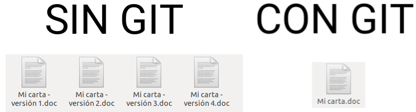

En este tutorial vamos a explicar cómo **crear una cuenta y repositorios** desde la propia interfaz web de GitHub.

# Antes de empezar

No se requiere ningún tipo de conocimientos técnicos.

# ¿Qué es GitHub?

Antes de explicar qué es GitHub, conviene explicar qué es Git.

> Git es un software de control de versiones diseñado por Linus Torvalds.

Vale, pero... ¿Qué es un control de versiones?

> El control de versiones es un sistema que registra los cambios realizados sobre un documento a lo largo del tiempo, de modo que puedas recuperar versiones específicas de dicho documento.

Entonces, ¿Qué es GitHub?

> GitHub es una plataforma para alojar proyectos utilizando el sistema de control de versiones de Git.

**Ejemplo**

Supongamos que estamos escribiendo un carta y a medida que redactamos un párrafo guardamos el documento con el estado actual. Al cabo de 3 párrafos tendremos 3 versiones del documento.

- Versión 1: 1er párrafo
- Versión 2: 1er y 2º párrafo
- Versión 3: 1er, 2º y 3er párrafo

Supongamos que nos arrepentimos del texto redactado en el 2º párrafo y lo borramos. En este caso tendremos 4 versiones.

- Versión 1: 1er párrafo
- Versión 2: 1er y 2º párrafo
- Versión 3: 1er, 2º y 3er párrafo
- versión 4: 1er y 3er párrafo

Viendo esto podemos ver que aunque en la última versión de nuestro documento no aparece el 2º párrafo, realmente lo tenemos guardado en la versión 2 y 3 de nuestro historial, con lo cual en un futuro podríamos acceder a dichas versiones para recuperar el texto del 2º párrafo.




## Aliquam ante felis

In hac habitasse platea dictumst, consectetur adipiscing elit. Aliquam ante felis, elementum sit amet purus et.

```sh
pi@raspberrypi:~ $ lsusb
```

### Aliquam ante felis

Lorem ipsum dolor sit amet, consectetur adipiscing elit. Aliquam ante felis, elementum sit amet purus et, feugiat pharetra diam. 

```python
import RPi.GPIO as GPIO
import time

GPIO.setmode(GPIO.BOARD)
GPIO.setup(7, GPIO.OUT)

led = GPIO.PWM(7, 100)

while True:
   led.start(0)
   for i in range(0, 100, 25):
      led.ChangeDutyCycle(i)
      time.sleep(0.5)
```

# Resumen

Nullam in tortor congue, *scelerisque lorem ut*, congue odio. In hac habitasse platea dictumst, consectetur adipiscing elit. Aliquam ante felis, elementum sit amet purus et. Lorem ipsum dolor sit amet, consectetur adipiscing elit. Aliquam ante felis, elementum sit amet purus et, feugiat pharetra diam.

# Ejercicios propuestos

1.- Lorem ipsum dolor sit amet, consectetur adipiscing elit. Aliquam ante felis, elementum sit amet purus et, feugiat pharetra diam.

2.- Aliquam ante felis, elementum sit amet purus et, feugiat pharetra diam. Lorem ipsum dolor sit amet, consectetur adipiscing elit. Aliquam ante felis, elementum sit amet purus et.

