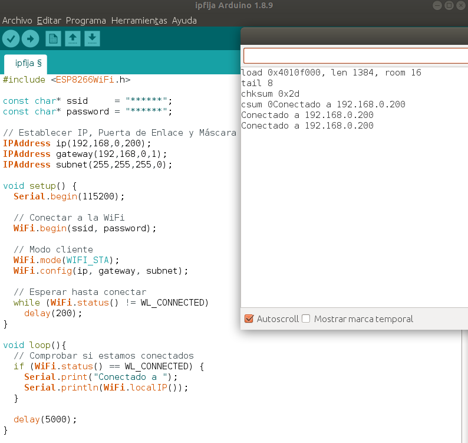

En este tutorial vamos a crear un **servidor web para controlar los pines GPIO** de nuestra placa NodeMCU ESP8266 y encender o apagar un LED desde el móvil conectado a la WiFi.

## Requisitos

Para este tutorial vas a necesitar los siguientes componentes:

- NodeMCU o equivalente
- Arduino IDE con placa NodeMCU ESP12

Antes de comenzar es recomendable visitar los siguientes tutoriales:

- [Placa de desarrollo NodeMCU ESP8266](nodemcu-esp8266)
- [Programar ESP8266 con el IDE de Arduino](nodemcu-esp8266-arduino_ide)
- [Conectar a la WiFi una ESP8266](nodemcu-esp8266-wifi)

---

<div class="toc">

- [Conectando a la WiFi](#conectando-a-la-wifi)
  - [IP Fija en ESP8266](#ip-fija-en-esp8266)
  - [Servidor Web en ESP8266](#servidor-web-en-esp8266)
  - [Pines GPIO mediante webservice](#pines-gpio-mediante-webservice)
- [Resumen](#resumen)
- [Ejercicios propuestos](#ejercicios-propuestos)

</div>

# Conectando a la WiFi

En primer lugar debemos ser capaces de conectar nuestra placa ESP8266 a la WiFi como se explica en tutoriales anteriores. En este tutorial además asignaremos una dirección IP fija a nuestra placa para que siempre tenga la misma aunque se desconecte de la WiFi. Por último accederemos desde el móvil para controlar diferentes pines GPIO.

## IP Fija en ESP8266

De forma similar que cuando nos conectábamos a una red WiFi, nuestro router nos asigna de forma automática una dirección IP. Sin embargo, podemos asignar una IP fuera del rango que ofrece el router para controlar nuestra placa con una IP Fija.

En este caso, vamos a conectar nuestra ESP8266 a la IP *192.168.0.200* en la cual nos hemos asegurado que está disponible y fuera de la asignación automática por nuestro router.



Lo que tenemos que añadir a nuestro código, es la asignación de dicha dirección IP, Puerta de Enalce (dirección IP del Router) y Máscara de Red.

En la función `setup()`, además de establecer la conexión en modo cliente añadimos la configuración de los parámetros para que asigne los establecidos por nosotros.

En la función `loop()` mostramos la IP que hemos asignado para comprobar que todo ha funcionado correctamente.

```arduino
#include <ESP8266WiFi.h>

const char* ssid     = "******";
const char* password = "******";

// Establecer IP, Puerta de Enlace y Máscara
IPAddress ip(192,168,0,200);
IPAddress gateway(192,168,0,1);
IPAddress subnet(255,255,255,0);

void setup() {
  Serial.begin(115200);

  // Conectar a la WiFi
  WiFi.begin(ssid, password);

  // Modo cliente
  WiFi.mode(WIFI_STA);
  WiFi.config(ip, gateway, subnet);

  // Esperar hasta conectar
  while (WiFi.status() != WL_CONNECTED)
    delay(200);
}

void loop(){
  // Comprobar si estamos conectados
  if (WiFi.status() == WL_CONNECTED) {
    Serial.print("Conectado a ");
    Serial.println(WiFi.localIP());
  }
  
  delay(5000);
}
```

## Servidor Web en ESP8266

Una vez tenemos fija la dirección IP, vamos a añadir la funcionalidad para comunicarnos con la placa ESP8266 a través de un navegador conectado a la misma red.

En primer lugar vamos a mostrar un código HTML con el mensaje *Hola Mundo*.


En primer lugar necesitamos añadir la librería `ESP8266WebServer.h` encargada de controlar el servidor web. Además, le indicamos que el puerto por el cual se va a escuchar es el puerto 80.

En la función `setup()` le indicamos que tras la petición "/" o raiz, llamaremos a la función `handleRoot()` encargada de mostrar el mensaje 'Hola Mundo'.

En la función `loop()` solamente hemos añadido la escucha de clientes en caso de estar conectados a la WiFi.

```arduino
#include <ESP8266WiFi.h>
#include <ESP8266WebServer.h> 

const char* ssid     = "******";
const char* password = "******";

// Establecer IP, Puerta de Enlace y Máscara
IPAddress ip(192,168,0,200);
IPAddress gateway(192,168,0,1);
IPAddress subnet(255,255,255,0);

// Puerto del servidor web
ESP8266WebServer server(80);

void setup() {
  Serial.begin(115200);

  // Conectar a la WiFi
  WiFi.begin(ssid, password);

  // Modo cliente
  WiFi.mode(WIFI_STA);
  WiFi.config(ip, gateway, subnet);

  // Esperar hasta conectar
  while (WiFi.status() != WL_CONNECTED)
    delay(200);

  // Arrancar el servidor
  server.on("/", handleRoot);
  server.begin();
}

void loop(){
  // Comprobar si estamos conectados
  if (WiFi.status() == WL_CONNECTED) {
    server.handleClient();
  }
  
}

void handleRoot() {
  server.send(200, "text/plain", "Hola Mundo");
}
```

## Pines GPIO mediante webservice


---

# Resumen

Como hemos visto, es muy sencillo utilizar la WiFi gracias a la librería `ESP8266WiFi.h`. Aunque realmente hay muchas más funcioones disponibles que puedes encontrar en la [documentación](https://arduino-esp8266.readthedocs.io/en/latest/esp8266wifi/readme.html).

---

# Ejercicios propuestos

1.- Busca todas las redes WiFi disponibles y conectate a una red WiFi conocida.

2.- Utilizando los pines GPIO, añade un LED rojo y un LED verde indicando cuando estás conectado a una red y cuando no lo estás.
