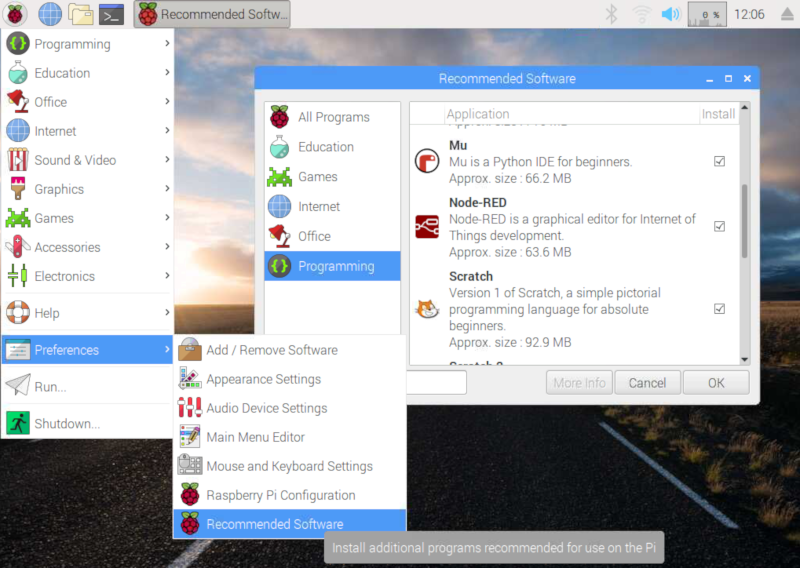
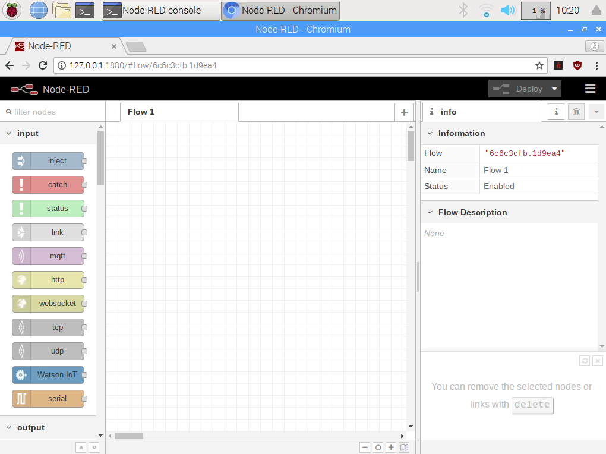

En este tutorial vamos a explicar cómo **utilizar la herramienta Node-RED desde Raspberry Pi** de una forma muy sencilla para crear aplicaciones IoT sin saber programar en lenguaje de programación textual.

<div class="toc">

- [Node-RED](#node-red)
  - [Instalación de Node-RED](#instalaci%C3%B3n-de-node-red)
  - [Node-RED en Raspberry Pi](#node-red-en-raspberry-pi)
- [Resumen](#resumen)
- [Ejercicios propuestos](#ejercicios-propuestos)

</div>

# Node-RED

[Node-RED](https://nodered.org/) es un motor de flujos con enfoque IoT que permite definir gráficamente flujos de servicios a través de protocolos estándares como REST, MQTT, Websocket o AMQP. Se trata de una herramienta visual muy ligera programada en NodeJS y que puede ejecutarse desde en dispositivos ligeros como la Raspberry Pi.

## Instalación de Node-RED

Esta herramienta viene instalada por defecto en la versión de Raspbian con programas recomendados. En caso de utilizar otra versión y querer instalarla podemos hacerlo desde el menú `Preferences > Recommended Software` e instalarlo desde la pestaña `programming`.



## Node-RED en Raspberry Pi

Podemos abrir Node-RED accediendo al menú `Programming > Node-RED` y se abrirá en segundo plano una terminal encargada de arrancar la herramienta. Una vez abierta accedemos mediante nuestro navegador predeterminado a la dirección `http://127.0.0.1:1880` o a través de la red a la IP de nuestra Raspberry Pi seguido del mismo puerto, en nuestro caso `http://192.168.0.138:1880`.

```
URL: http://127.0.0.1:1880
```



Los programas en Node-RED se llaman **Flow** (flujos) y se puede crear tantos flujos como queramos y todos pueden ejecutarse al mismo tiempo. 

En el lado izquierdo tenemos todos los nodos disponibles ordenador por categorías (input, output, functions, etc.). Los nodos se conectarán entre ellos mediante líneas creando un flujo de trabajo. En el lado derecho aparecerán los parámetros de configuración de cada nodo seleccionado. En el centro es donde podemos arrastrar los nodos para crear el flujo de trabajo.

# Resumen

En este tutorial hemos visto una forma sencilla de programar sin utilizar una línea de código. Todo se basa en nodos unidos mediante líneas.

---

# Ejercicios propuestos

1.- Programa el encendido y apagado de múltiples diodos LEDs.
