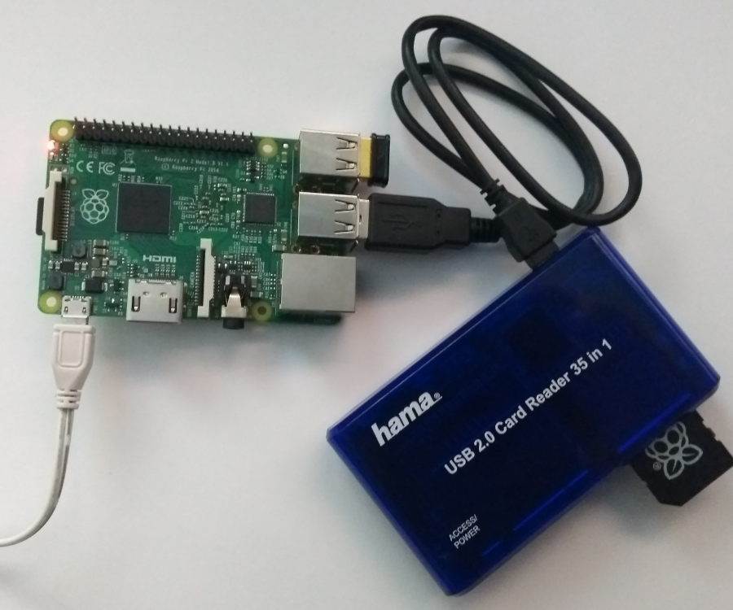
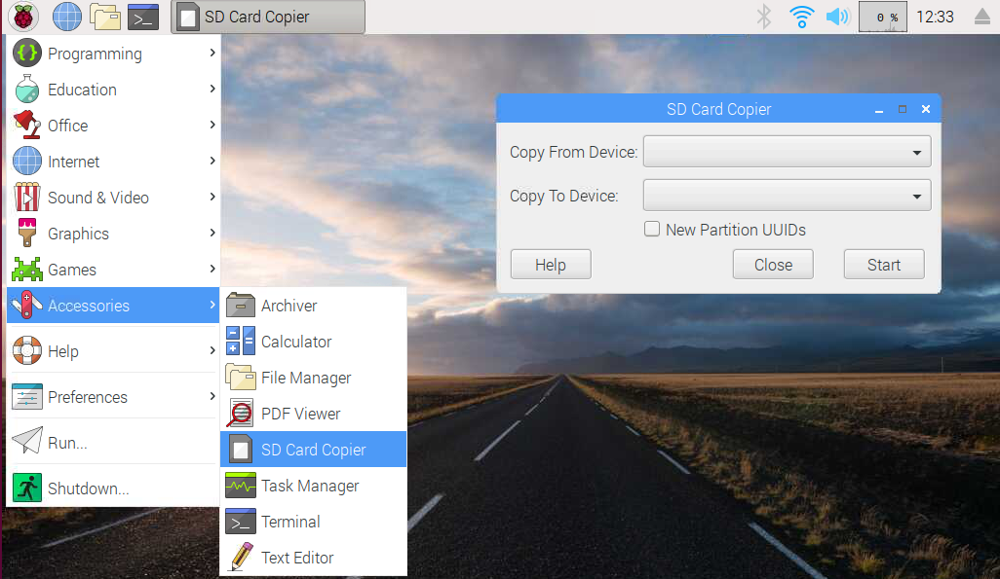
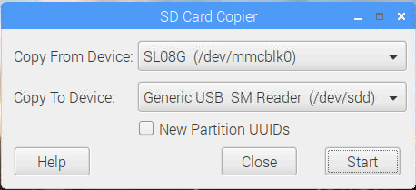

# Clonar tarjeta SD en Raspbian con piclone

Piclone (SD Card Copier) es la herramienta que integra el sistema operativo Raspbian para el clonado de tarjetas microSD de forma gráfica, es decir, podemos copiar todo el contenido de una tarjeta microSD a otra haciendo un clon idéntico sin utilizar la línea de comandos.

Para utilizar la aplicación deberás disponer de un hub USB de tarjetas SD.



## SD Card Copier

Para acceder a la herramienta accedemos desde el entorno gráfico de Raspbian a `Inicio > Accesorios > SD Card Copier`. Otra forma de acceder es mediante el comando `piclone` desde una nueva terminal. De una u otra forma se abrirá el asistente SD Card Copier como se muestra en la siguiente imagen.

```sh
pi@raspberrypi:~ $ piclone
```



Si nos fijamos en la imagen, debemos seleccionar el dispositivo desde donde queremos copiar (seleccionando la actual SD */dev/mmcblk0*) y hacia donde, en nuestro caso, un Hub USB utilizando una tarjeta SM en `/dev/sdd`.



El proceso suele tardar aproximadamente 20 minutos, un tiempo muy similar a la instalación por defecto de Raspbian, con la diferencia que nos ahorramos instalar los programas y configuraciones realizadas sobre nuestra Raspberry Pi.
