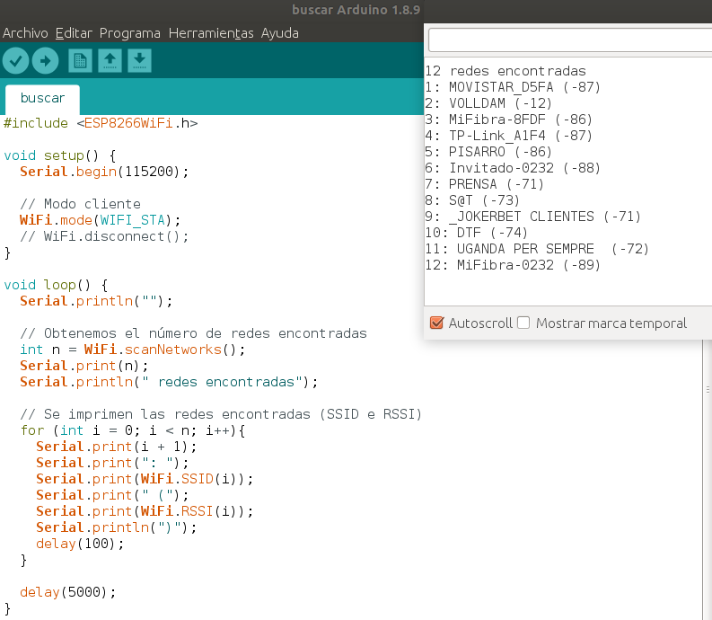
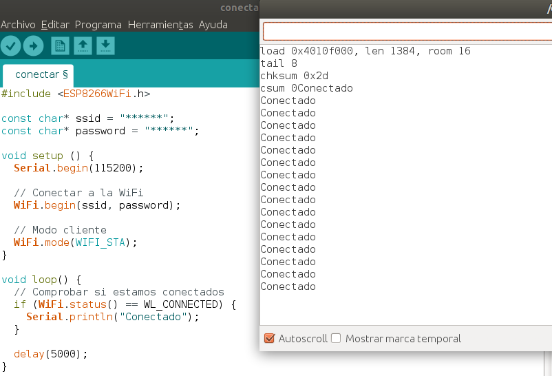

En este tutorial vamos a explicar cómo **buscar señales WiFi con la ESP8266** para conectarnos en modo cliente o estación a una red conociendo el SSID y la contraseña.

## Requisitos

Para este tutorial vas a necesitar los siguientes componentes:

- NodeMCU o equivalente
- Arduino IDE con placa NodeMCU ESP12

Antes de comenzar es recomendable visitar los siguientes tutoriales:

- [Placa de desarrollo NodeMCU ESP8266](nodemcu-esp8266)
- [Programar ESP8266 con el IDE de Arduino](nodemcu-esp8266-arduino_ide)

---

<div class="toc">

## Tabla de contenidos

- [NodeMCU ESP8266 WiFi](#nodemcu-esp8266-wifi)
  - [Buscar señales WiFi](#buscar-se%C3%B1ales-wifi)
  - [Conectar a una red WiFi](#conectar-a-una-red-wifi)
- [Resumen](#resumen)
- [Ejercicios propuestos](#ejercicios-propuestos)

</div>

# NodeMCU ESP8266 WiFi

Conectarse a una red Wifi con la ESP8266 es muy sencillo gracias a la librería ESP8266WiFi, añadida anteriormente en el IDE de Arduino.

## Buscar señales WiFi

La idea es obtener a través del monitor del IDE de Arduino el listado de todas las redes WiFi encontradas. Y este proceso se repetirá cada 5 segundos. Para cada red encontrada se mostrará el SSID (nombre de la WiFi) y el RSSI (intensidad de la señal). 

> Cuanto mayor sea el RSSI mejor será la señal encontrada.



En primer lugar cargamos la librería `ESP8266WiFi.h` para poder utilizar las funciones sobre la WiFi. 

En la función `setup()` establecemos la velocidad de transmisión a 115200 baudios y establecemos el modo de conexión, que en este caso es en modo cliente o estación `WiFi.mode(WIFI_STA)`.

En la función `loop()` vamos a escanear cada 5 segundos en busca de redes, y esto lo hacemos con la función `WiFi.scanNetworks()` la cual obtiene el número de redes disponibles. A continuación, por cada una de las redes encontradas mostramos los valores que nos interesa, que son el SSID mediante la función `WiFi.SSID(i)` y el RSSI mediante la función `WiFi.RSSI(i)`.

```arduino
#include <ESP8266WiFi.h>

void setup() {
  Serial.begin(115200);

  // Modo cliente
  WiFi.mode(WIFI_STA);
}

void loop() {
  Serial.println("");

  // Obtenemos el número de redes encontradas
  int n = WiFi.scanNetworks();
  Serial.print(n);
  Serial.println(" redes encontradas");

  // Se imprimen las redes encontradas (SSID e RSSI)
  for (int i = 0; i < n; i++){
    Serial.print(i + 1);
    Serial.print(": ");
    Serial.print(WiFi.SSID(i));
    Serial.print(" (");
    Serial.print(WiFi.RSSI(i));
    Serial.println(")");
    delay(100);
  }

  delay(5000);
}
```

## Conectar a una red WiFi

Una vez tenemos el listado de redes WiFi disponibles, vamos a conectarnos a una mediante SSID y password conocido.



Además de importar la librería, vamos a establecer las constantes SSID y PASSWORD que utilizaremos en la función `setup()` para establecer la conexión.

En la función `loop()` simplemente comprobaremos si estamos conectados a la WiFi mediante la función `WiFi.status()` la cual me indica si estoy conectado o no.

```arduino
#include <ESP8266WiFi.h>
 
const char* ssid = "NOMBRE";
const char* password = "PASSWORD";
 
void setup () {
  Serial.begin(115200);

  // Conectar a la WiFi
  WiFi.begin(ssid, password);

  // Modo cliente
  WiFi.mode(WIFI_STA);

  // Esperar hasta conectar
  while (WiFi.status() != WL_CONNECTED)
    delay(200);
}
 
void loop() {
  // Comprobar si estamos conectados
  if (WiFi.status() == WL_CONNECTED) {
    Serial.println("Conectado");
  }
  
  delay(5000);
}
```

---

# Resumen

Como hemos visto, es muy sencillo utilizar la WiFi gracias a la librería `ESP8266WiFi.h`. Aunque realmente hay muchas más funcioones disponibles que puedes encontrar en la [documentación](https://arduino-esp8266.readthedocs.io/en/latest/esp8266wifi/readme.html).

---

# Ejercicios propuestos

1.- Busca todas las redes WiFi disponibles y conectate a una red WiFi conocida.

2.- Utilizando los pines GPIO, añade un LED rojo y un LED verde indicando cuando estás conectado a una red y cuando no lo estás.
