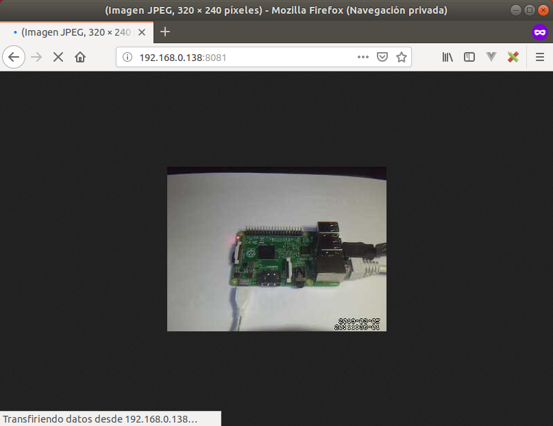

# Detecta movimientos con una webcam y Motion en Raspberry Pi

[Motion](https://motion-project.github.io/) es uno de los programas más populares para utilizar con webcams, cuya utilidad es la de detectar movimientos. De esta forma podemos grabar momentos en los cuales se ha detectado movimiento. 

> Recordamos que antes de instalar Motion debemos asegurarnos que nuestra webcam ha sido reconocida por el Sistema Operativo como se explica en el tutorial [Raspberry Pi - Webcam - LUVCview](raspberry_pi-webcam-luvcview)

## Instalar Motion

> Recordamos que antes de instalar cualquier software es conveniente tener actualizado el listado de repositorios con el comando `apt-get update` como se explica en el tutorial [Raspberry Pi - Raspbian - Update](raspberry_pi-raspian-update)
 
Una vez actualizada la lista de paquetes del repositorio, podemos instalar Motion mediante el comando `apt-get install motion`.

```sh
pi@raspberrypi:~ $ sudo apt-get install motion
```

Para comprobar que se ha instalado correctamente, abrimos un navegador en la misma Raspberry Pi, accedemos a la dirección `localhost:8081` y se debe ver la webcam.


## Detectar movimientos

ToDo

## Acceder a Motion de forma remota

Probablemente lo que nos interese sea ver el contenido de la webcam desde fuera de la Raspberry Pi, por ejemplo, para controlar un bebe desde otra habitación. Para ello vamos a configurar Motion para que nos permita acceder desde la propia red local.

### Configurar Motion

En primer lugar accedemos al fichero `/etc/motion/motion.conf` donde aparecen todas las opciones de configuración de Motion. Para abrirlo de una forma sencilla y con privilegios de administrador introducimos el comando `sudo leafpad /etc/motion/motion.conf`.

```sh
pi@raspberrypi:~ $ sudo leafpad /etc/motion/motion.conf
```

Vamos a indicar en el fichero de configuración que el software arranque como servicio. Para ello cambiamos el valor `daemon on`. También debemos especificar el puerto web por el cual veremos nuestra webcam y que no solamente se va a reproducir en modo local sino que además debemos permitir el acceso desde fuera de la red local.

> Como se puede observar, en este fichero aparecen diferentes configuración por defecto, y a medida que vayamos teniendo experiencia podemos ir probando.

```
# Start in daemon (background) mode and release terminal (default: off)
daemon on

# The mini-http server listens to this port for requests (default: 0 = disabled)
stream_port 8081

# Restrict stream connections to localhost only (default: on)
stream_localhost off
```

### Arrancar Motion al enceder la Raspberry Pi

En este caso vamos a configurar el fichero de configuración encargado de habilitar el daemon de Motion al iniciar la Raspberry Pi. Para ello accedemos al fichero `/etc/default/motion`. Para abrirlo de una forma sencilla y con privilegios de administrador introducimos el comando `sudo leafpad /etc/default/motion`.

```sh
pi@raspberrypi:~ $ sudo leafpad /etc/default/motion
```

```
# set to 'yes' to enable the motion daemon
start_motion_daemon=yes
```

Por último, reseteamos el servicio con el comando `service motion restart` para que los cambios tengan efecto y una vez reiniciado el servicio ya podemos acceder desde la propia red local a la dirección IP de la Rasbperry Pi, en nuestro caso, la ip `192.168.0.138:8081`.

```sh
pi@raspberrypi:~ $ sudo service motion restart
```




## Siguiente tutorial

Hasta ahora ya tenemos Motion configurado para ver una webcam desde la propia Raspberry Pi o desde la red local. Sin embargo, en ocasiones nos gustaría poder ver qué ocurre desde fuera de la red, es decir, desde el trabajo o desde nuestro lugar de vacaciones.

Para ello lo que tenemos que hacer es configurar un tunel SSH a través de una Red Privada Virtual y eso lo explicamos en el tutorial [Raspberry Pi - OpenVPN](raspberry_pi-openvpn)
