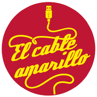

<h1 class="align-center"> Proyecto educativo de código abierto para fomentar el uso de la <strong>programación y robótica</strong> en los centros educativos utilizando herramientas de <strong>software y hardware libre</strong>.</h1>

 

## Autores de las prácticas

<ul>
    
    
        
            <li>{{ author }} ({{ practica.size }} prácticas)</li>
        
    
</ul>

 

## Ediciones

* **3ª Edición: Octubre, 2018**: Nuevas prácticas realizadas por docentes a través del curso de Robótica en Secundaria impartido a través del Centro de Profesorado y Recursos de la Región de Murcia. 
* **2ª Edición: Febrero, 2018**: Nuevas prácticas incorporadas al repositorio de la 1ª Edición realizadas por docentes a través del curso de Robótica en Secundaria impartido a través del Centro de Profesorado y Recursos de la Región de Murcia.
* **1ª Edición: Enero, 2017**: [Proyecto El Cable Amarillo](https://github.com/ElCableAmarillo). Financiado por el Fondo Europeo de Desarrollo Regional de la Región de Murcia.

 

## Licencia

Esta obra está bajo una licencia de [Creative Commons Reconocimiento-CompartirIgual 4.0 Internacional](https://creativecommons.org/licenses/by-sa/4.0/deed.es_ES). 

Usted es libre de:

* **Compartir**: Compartir y redistribuir el material en cualquier medio o formato.
* **Adaptar**: Remezclar, transformar y crear a partir del material para cualquier finalidad, incluso comercial.

Bajo las siguientes condiciones:

* **Reconocimiento**: Debe reconocer adecuadamente la autoría, proporcionar un enlace a la licencia e indicar si se han realizado cambios. Puede hacerlo de cualquier manera razonable, pero no de una manera que sugiera que tiene el apoyo del licenciador o lo recibe por el uso que hace.
* **CompartirIgual**: Si remezcla, transforma o crea a partir del material, deberá difundir sus contribuciones bajo la misma licencia que el original.